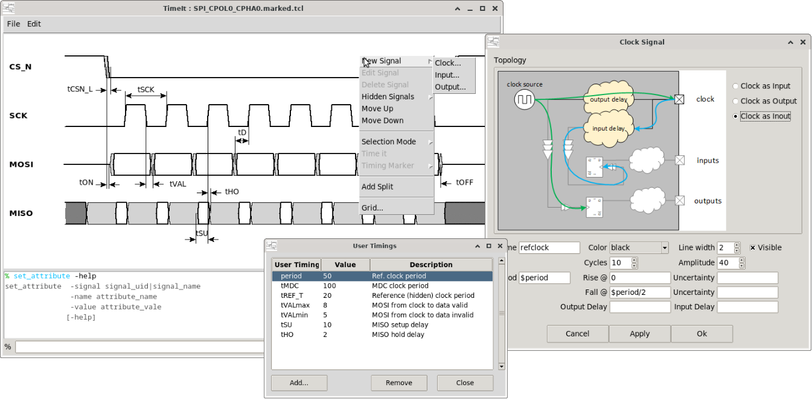

# TimeIt

TimeIt is a graphical timing diagram specification editor designed for digital hardware engineers. It lets you describe and visualise the temporal relationships between signals in a synchronous digital system — clocks, inputs, outputs, timing markers and annotations — all through a simple scripting console combined with an interactive canvas. Timings can be given as resolved values, variables and expressions.

---

> ✍️ **Author’s note**
>
> A friend of mine will probably be mad at me when he discovers that this tool is written entirely in Python! And yes, I admit that a C++ version would likely have been much more efficient and probably better-looking.
>
> The reason I chose Python is simple: many IT departments do not allow binary files to be deployed on employees’ computers. The entire TimeIt application was therefore intentionally written in Python, using a minimal and well-known set of packages. Anyone can inspect the source code and even modify it if needed.
>
> It does not make any network connection, and it can be installed simply by copying the script bundle, without administrator rights.
>
> Do not forget to check for updates from time to time — some interesting new features are planned.

---
## Contact

timeit.oss+contact@gmail.com

## Documentation

Full user guide is in the [`docs/`](docs/) folder.

| # | Topic |
|---|---|
| [Introduction](docs/00_introduction.md) | What TimeIt is, key concepts, screenshot gallery |
| [01](docs/01_install.md) | How to get and install TimeIt |
| [02](docs/02_launch.md) | How to launch TimeIt |
| [03](docs/03_clock_signal.md) | How to create clock signal(s) |
| [04](docs/04_io_signals.md) | How to create input / output signal(s) |
| [05](docs/05_timing_markers.md) | How to create timing markers |
| [06](docs/06_save_load.md) | How to save and load |
| [07](docs/07_grid.md) | How to show the background grid |
| [08](docs/08_export.md) | How to export the canvas |
| [09](docs/09_annotations.md) | How to create timing annotations |
| [10](docs/10_copy_signal.md) | How to copy a signal |
| [11](docs/11_move_signal.md) | How to move a signal |
| [12](docs/12_delete_signal.md) | How to delete a signal |
| [13](docs/13_modify_signal.md) | How to modify a signal |
| [14](docs/14_layout.md) | How to lay out signals in the canvas (waveform settings) |
| [15](docs/15_command_help.md) | How to see command help notices |
| [16](docs/16_scale_canvas.md) | How to scale waveform canvas |
| [17](docs/17_timing_vars.md) | How to use timing variables |