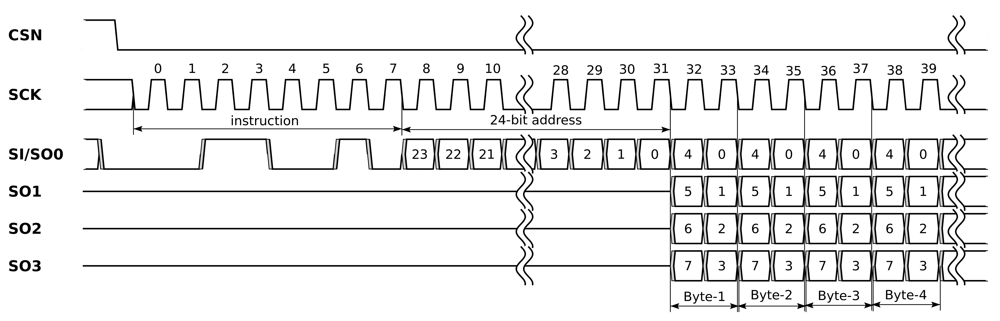
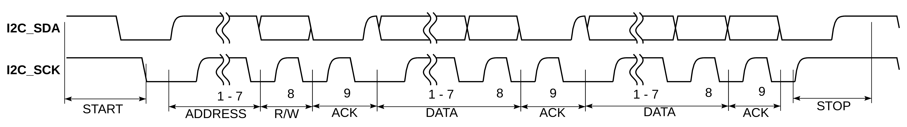
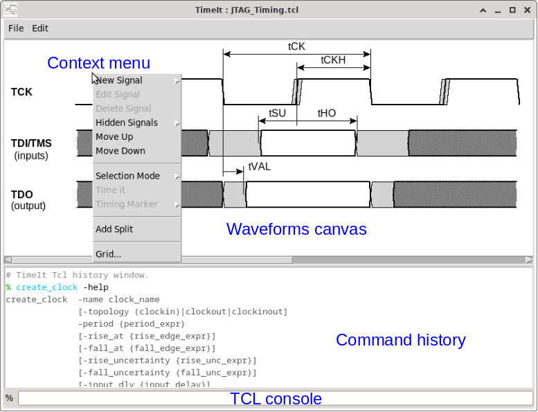

# TimeIt — Timing Diagram Editor

## What is TimeIt?

TimeIt is a graphical timing diagram specification editor designed for digital hardware engineers. It lets you describe and visualise the temporal relationships between signals in a synchronous digital system — clocks, inputs, outputs, timing markers and annotations — all through a simple scripting console combined with an interactive canvas. Timings can be given as resolved values, variables and expressions.

Typical use cases include:

- Documenting I/O interface timing requirements (setup/hold, input/output delays)
- Explaining data-path timing to colleagues or in design review documents
- Cross-checking STA (Static Timing Analysis) constraints visually before writing SDC
- Creating publication-quality timing diagrams for datasheets and design specifications

## Key concepts

| Concept | Description |
|---|---|
| **Clock signal** | Periodic reference waveform with configurable period, edges and uncertainty |
| **Input signal** | Signal driven externally and captured internally; delays expressed as input delays |
| **Output signal** | Signal launched internally and read externally; delays expressed as output delays |
| **Timing marker** | Horizontal measurement arrow between two waveform points |
| **Waveform annotation** | Text or colour highlight placed on a waveform segment |
| **TCL console** | Built-in command interpreter where all signals are created and configured |

The resulting waveform canvas can be exported in several popular graphical formats, including both bitmap and vector formats. Although the tool offers many editing options, some specific waveform annotations or details may not be directly supported. In such cases, the user can export the canvas in a vector format, such as SVG, and complete the editing with other drawing tools.

In addition to its documentation purpose, the tool can also help users understand I/O constraint concepts in ASIC/SoC design process by providing a realistic representation of input and output delays.

## Screenshots

### Example QSPI timing diagram

### Example I2C frame illustration

### Main application window

---

## Documentation index

| # | Topic |
|---|---|
| [01](01_install.md) | How to get and install TimeIt |
| [02](02_launch.md) | How to launch TimeIt |
| [03](03_clock_signal.md) | How to create clock signal(s) |
| [04](04_io_signals.md) | How to create input / output signal(s) |
| [05](05_timing_markers.md) | How to create timing markers |
| [06](06_save_load.md) | How to save and load |
| [07](07_grid.md) | How to show the background grid |
| [08](08_export.md) | How to export the canvas |
| [09](09_annotations.md) | How to create timing annotations |
| [10](10_copy_signal.md) | How to copy a signal |
| [11](11_move_signal.md) | How to move a signal |
| [12](12_delete_signal.md) | How to delete a signal |
| [13](13_modify_signal.md) | How to modify a signal |
| [14](14_layout.md) | How to lay out signals in the canvas (waveform settings) |
| [15](15_command_help.md) | How to see command help notices |
| [16](16_scale_canvas.md) | How to scale waveform canvas |
| [17](17_timing_vars.md) | How to use timing variables |
