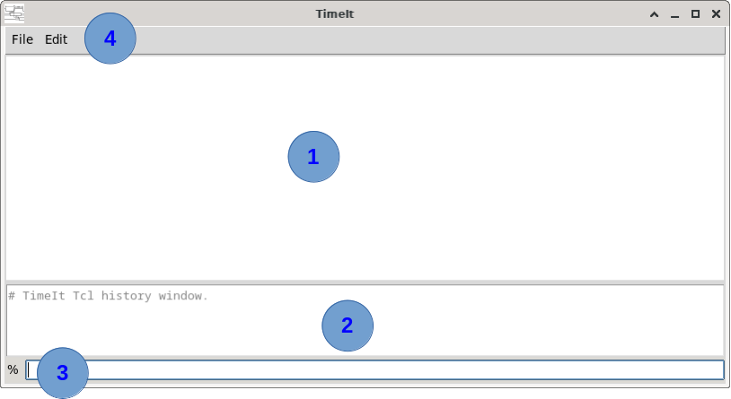
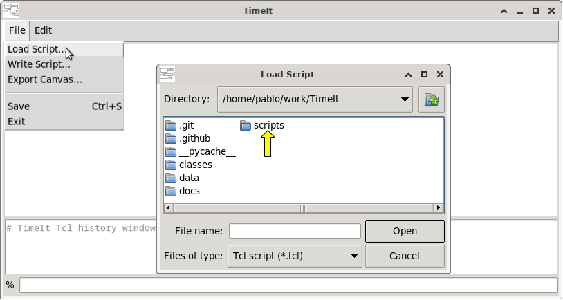

# How to launch TimeIt

## Running from the command line

TimeIt is a Python module. If extracted directory name contains a version designator like `TimeIt-1.0.0`, it is better to rename as simply `TimeIt`. Then, from the directory right before `TimeIt`, run:

```bash
# In some systems : 'python' command is already bound to Python3   
python3 -m TimeIt.main
```

This opens the main application window containing the waveform canvas and the TCL console.

## Application layout overview




1. Waveform canvas (top area). Most edition actions on right-click contextual menu
2. Command history and log pane
3. TCL console / command entry (bottom area)
4. Menu bar

## Loading a script

Waveform diagrams are saved as TCL scripts. You can load and save your timing diagrams as TCL scripts. TimeIt comes with some examples in `scripts` directory.




> 💡 **Tip:** 
> 
>   Press <kbd>Ctrl</kbd>+<kbd>S</kbd> to save\
>   Press <kbd>Shift</kbd>+<kbd>Mouse wheel</kbd> to zoom


---

*Previous: [Installation](01_install.md) | Next: [How to create clock signal(s)](03_clock_signal.md)*
