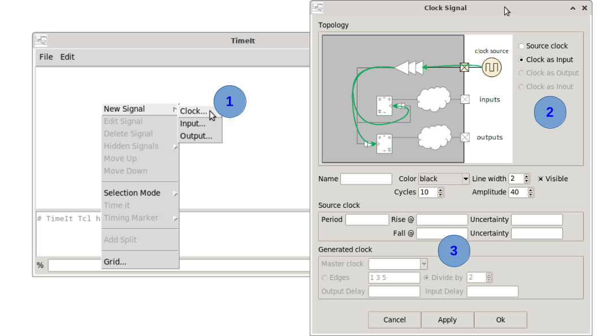
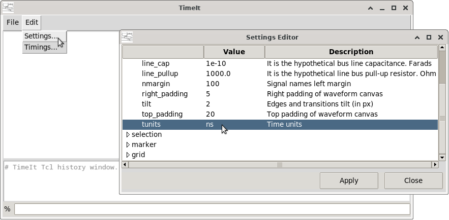
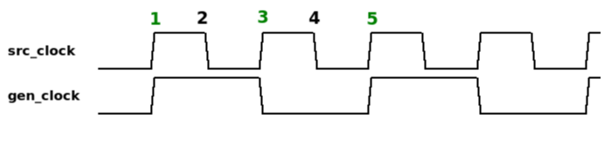
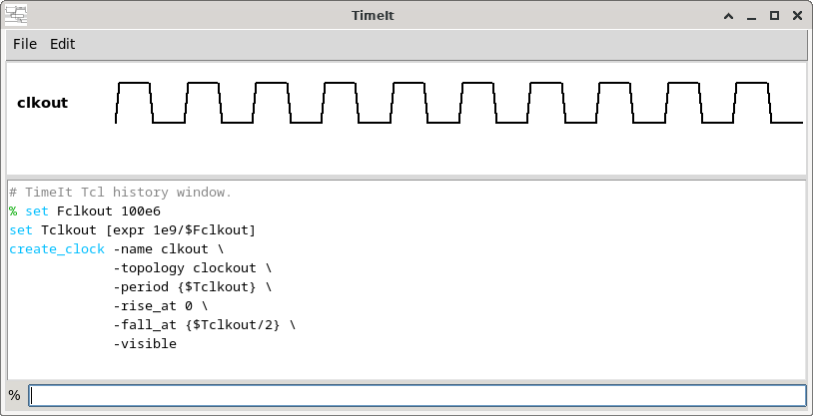

# How to create clock signal(s)

Clock signals are the timing reference for every other signal in the diagram. Use the `create_clock` command in the TCL console.
Even if you want to create an asynchronous signal you will need a clock to which it will refer. You can create unrelated clocks as references and hide them (they will not be `-visible` in the canvas). 

A clock signal can be created by using the GUI or by using the TCL command `create_clock`

Two type of clocks can be created.
   1.- Source clocks
   2.- Generated/Derived clocks

To create a generated clock, a source clock must be created first. Clocks having same source are considered as being "related". Clock with different sources (even if their timing attributes are the same) will be considered "unrelated".  


## GUI procedure



1. <kbd>Mouse Right-click</kbd> in the canvas area. Select **New Signal→Clock...**
2. Select the clock topology of your device (if relevant).
    * Source clocks topologies are: "source" and "clock input"
    * Generated clock topologies are: "clock output" and "clock inout"  
3. Complete the clock description. Not all fields are mandatory (see command documentation).
    * **DO NOT** forget to select a "Master (source) clock" in generated clock creation.

Notice that it is not possiblke to create generated clocks ("clock out" or "clock inout" topologies) if there is not at least one source clock already created. Create first source clocks. 


For source clock specification you can specify timings directly by using floating point numbers, but it is good practise to specify your timings by using timing variables. Timing variables shall be created before calling the `create_clock` form. You can always give numbers and then change to variables later.

More on timing variables here: [How to timing variables](17_timing_vars.md)

**Note:** Time units are specified in the *Waveforms Settings* (**Edit→Settings...**)  



All timing numbers must be consistent with the chosen timing units.

A generated clock derives its waveform from its source clock: it is not given a period or edge times of its own. The resulting frequency is equal or slower (divided) than its source. It is not possible to create a generated clock faster than its source. Note that a generated clock does **not** inherit the edge uncertainties of its source: they are not drawn on it.

The generated clock waveform can be specified either by a edge list (three values) that correspond to the source clock edge index or by giving a divide by integer.

Example of a generated clock that is formed with source edges {1 3 5}. This is equivalent to a divide by 2. Notice that the last edge specified is the one that is considered as completing the generated clock cycle.




## Command syntax

```
create_clock  -name clock_name
	      [-topology source|(clockin)|clockout|clockinout]

              # Source clock ("source" and "clockin" topologies) :
              -period {period_expr}
              [-rise_at {rise_edge_expr}]
	      [-fall_at {fall_edge_expr}]
	      [-rise_uncertainty {rise_unc_expr}]
              [-fall_uncertainty {fall_unc_expr}]

              # Generated clock ("clockout" and "clockinout" topologies) :
              -master master_clock_name
              (-edges {rise fall cycle_end} | -divide_by divisor)
              [-invert]
              [-input_dly {input_delay}]
              [-output_dly {output_delay}]

              # Any topology :
              [-color (black)|green|red|blue|orange|purple]
              [-amplitude amp_value]
              [-lwidth line_width]
              [-visible]
	      [-show num_cycles]
              [-help]

```

## Key parameters

The topology decides which clock is created, and therefore which options apply. Source clock options are refused on a generated clock, and generated clock options are refused on a source clock.

| Parameter | Description |
|---|---|
| `-name` | **Mandatory.** Unique name for the clock signal. |
| `-topology` | Selects a **source** clock — `source`: root/primary clock, not tied to any interface port; `clockin` (default): clock comes from outside and feeds the interface — or a **generated** clock: `clockout`: clock is generated internally and goes out, its clock tree feeding both the output launching FFs and the input capturing FFs; `clockinout`: same, but the clock is fed back in and it is the returning one that clocks the input capturing FFs. |

### Source clock only (`source`, `clockin`)

The waveform is given explicitly.

| Parameter | Description |
|---|---|
| `-period` | **Mandatory.** Clock period expression (e.g. `{10}`). |
| `-rise_at` | Rising edge time. Default: `0`. |
| `-fall_at` | Falling edge time. Default: `period/2`. |
| `-rise_uncertainty` | Peak-to-peak rising edge uncertainty. Default: `0`. |
| `-fall_uncertainty` | Peak-to-peak falling edge uncertainty. Default: `0`. |

### Generated clock only (`clockout`, `clockinout`)

The waveform is not given: it is derived from the master clock. A generated clock does not inherit the uncertainties of its master.

| Parameter | Description |
|---|---|
| `-master` | **Mandatory.** Name of the source clock this clock derives from. It must already exist, and be a source clock (a generated clock can not be the master of another one). |
| `-edges` | **Mandatory** unless `-divide_by` is given (the two are mutually exclusive). `{rise fall cycle_end}`: the master clock edges that generate, respectively, the rising edge, the falling edge and the end of cycle of this clock. Master edges are numbered from **1** (the first edge of the master waveform, not `0`) and the three values must increase. `{1 2 3}` is a copy of the master, `{1 3 5}` a divide by 2. |
| `-divide_by` | **Mandatory** unless `-edges` is given. Integer >= 1. Shorthand for `-edges {1 divisor+1 2*divisor+1}`: `-divide_by 2` is `-edges {1 3 5}`. |
| `-invert` | Flag. Inverts (complements) the generated clock, with the same semantics as the SDC `create_generated_clock -invert` option: it falls where the direct clock would rise and rises where it would fall (e.g. an SPI CPOL=1 style clock). The period is unchanged. Combines with either `-edges` or `-divide_by`. |
| `-output_dly` | Delay the clock takes to come out of the interface (pad and combinatorial delay after the clock tree root). The whole derived waveform is drawn shifted right by it, since the diagram shows the clock at the pin. Default: `0`. |
| `-input_dly` | **`clockinout` only** (refused on `clockout`). Delay the fed back clock takes to come in, before the clock tree root of the capturing FFs. Default: `0`. |

### Any topology

| Parameter | Description |
|---|---|
| `-show` | Number of clock cycles to display. Default: 10. |
| `-color` | Waveform colour: `black` (default), `green`, `red`, `blue`, `orange`, `purple`. |
| `-amplitude` | Waveform height in pixels (default 40). |
| `-lwidth` | Line width in pixels (default 2). |
| `-visible` | Include flag to make the signal visible immediately. |


## Step-by-step example

### 1. Clock defined by frequency variable

```tcl
set Fclkout 100e6
set Tclkout [expr 1e9/$Fclkout]
create_clock -name clkout \
             -topology source \
             -period {$Tclkout} \
             -rise_at 0 \
             -fall_at {$Tclkout/2} \
             -visible
```



## Notes

- All timing values must use the same unit consistently (e.g. always ns or always ps).
- TCL variable expressions are enclosed in `{}` so that they are evaluated lazily by the TCL engine.
- Run `create_clock -help` in the console for the full built-in reference.

---

*Previous: [How to launch TimeIt](02_launch.md) | Next: [How to create input/output signal(s)](04_io_signals.md)*
