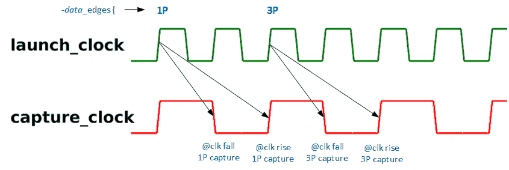
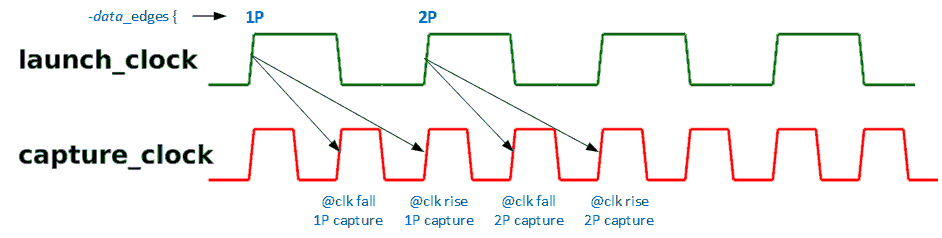
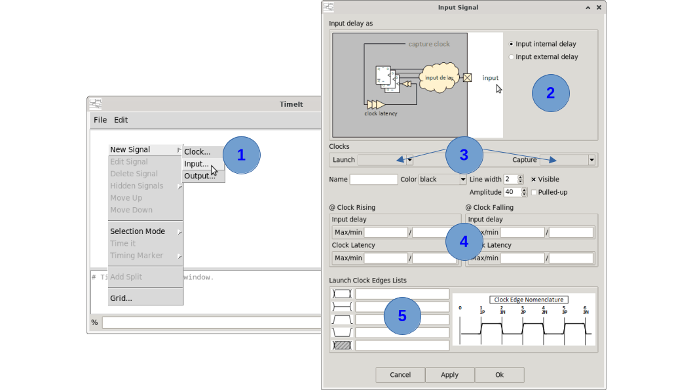
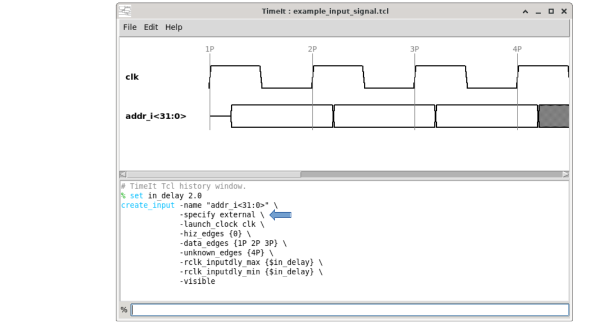
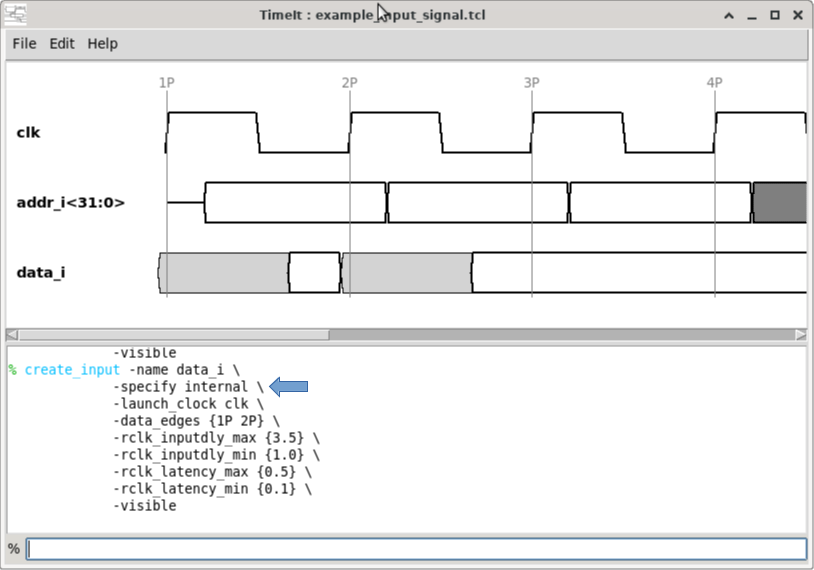
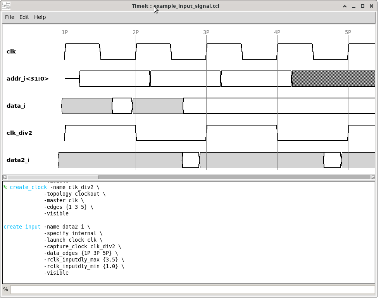
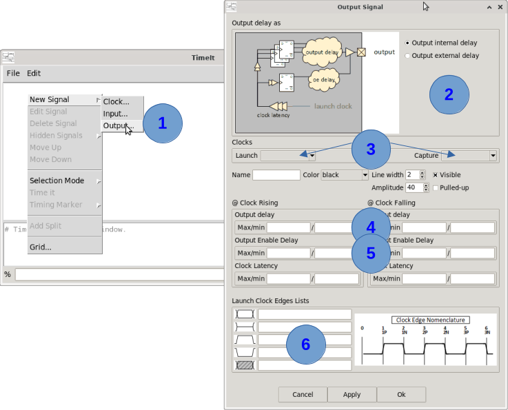
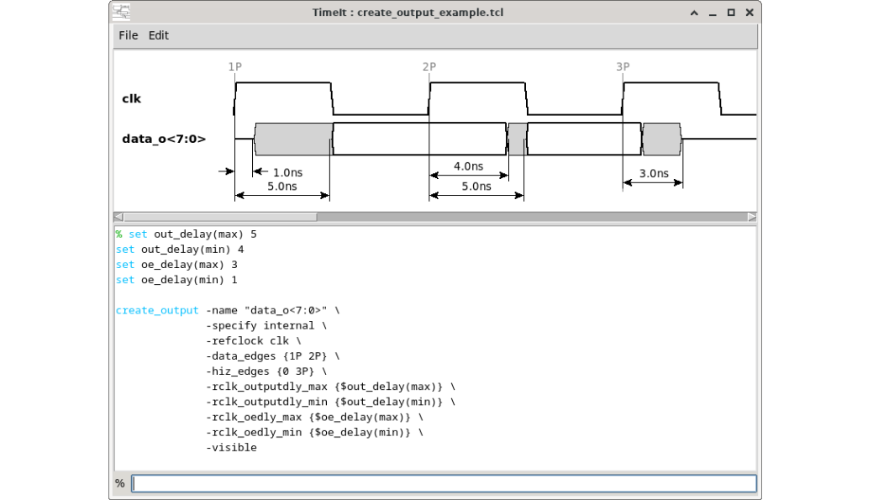

# How to create input / output signal(s)

Input and output signals represent data paths going from a **launch clock** to a **capture clock**. They are created with `create_input` and `create_output` in the TCL console.

---

## Launch clock and capture clock

Every data path is launched by one clock and captured by another:

- `-launch_clock` is the clock the data transitions are drawn against. **The edge lists (`-data_edges`, `-hiz_edges`, ...) always name launch clock edges.**
- `-capture_clock` is the clock the receiving flip-flops use. It is what the delays are measured against whenever they are specified from the capturing side (an **input** with `-specify internal`, an **output** with `-specify external`).

Both clocks must be **related**: they must share the same source clock. They may be the same clock, a source clock and a clock generated from it, or two clocks generated from the same source. Their periods may differ.

Giving only one of the two means the same clock launches and captures the data — this is the usual case, and it is what the former `-refclock` option did:

```tcl
# these two are equivalent
create_input -name data_i -launch_clock clk -capture_clock clk ...
create_input -name data_i -launch_clock clk ...
```

### Which edge captures the data?

This only comes into play when the delays are given from the capturing side — an **input** with `-specify internal`, an **output** with `-specify external`. In the two other combinations the delays run forward from the launch edge and no capturing edge is needed.

The edge lists only say where the data is **launched**, so the tool works out the capturing edge on its own. Two things decide it.

**First, the polarity**, which is induced by the delays you give: specify only `rclk_...` delays and the capturing flip-flops are taken to be rising-edge ones; only `fclk_...` and they are taken to be falling-edge ones. Give both (a DDR interface) and the data launched on one polarity is captured on the other.

**Then, which edge of that polarity**, looked up in the capture clock waveform:

- When the capture clock is **not faster** than the launch clock, the capturing edge is simply the first edge of that polarity that comes *after* the launch edge. An edge coinciding with the launch edge is not a candidate — the data launched there has not arrived yet.
- When the capture clock is **faster** (so the launch clock is a slow clock generated from it), the capturing edge is the one that *generates* the next edge of that polarity of the launch clock.

When launch and capture are the same clock this simply lands on its next edge of the opposite polarity, or on its next edge of the same polarity (a full period away).

Example — data launched on the rising edge of a source clock `clk`, captured by `clk_div2`, a clock generated from it with `-edges {1 3 5}`. The rising capture edge is the one generated by the 5th `clk` edge, the falling one the edge generated by the 3rd:



If we inverse roles. The capture edge in faster clock will be considered as follows:




## Input signals — `create_input`

An input signal is driven by an external source and captured by internal flip-flops. Delays can be specified as being external, this is typical of a pre-layout/synthesis view, or internal when, after implementation (post-layout/synthesis), the internal delays are known.

Specifying with external delays is the typical situation when constraining I/Os for implementation.

## GUI procedure



1. <kbd>Mouse Right-click</kbd> in the canvas area. Select **New Signal→Input...**
2. Select internal or external delays specification mode.  
3. Select the launch and capture clocks.
4. Complete the input description. Not all fields are mandatory (see command documentation). Rising and falling delays are both optional, and **which clock edge they refer to depends on the specification mode**:
    * **Internal** delays are the delays of your own capturing flip-flops, so they refer to the **capturing** clock edge, and their presence or absence is what tells the tool where the data is captured. Example: you give a rising launching edge list `1P 2P 3P ...` and you state *falling* clock input delays: the tool assumes the data is launched at 1P and captured at the next falling edge. If your system is posedge(launch)-posedge(capture), do not provide falling clock delays. Both rising and falling clock delays are typically given for a DDR interface.
    * **External** delays are the delays of the device driving the input, so they refer to the **launching** clock edge — the very edges of the edge lists. A rising edge in a list with no rising input delay given is assumed to have a 0 delay.
5. Launch clock edges list (white space separated) that correspond to the data launch. Example: 1P 3P 8P, means that the corresponding data type is lauched at clock edge 1P, 3P, 8P. Follow the illustrated clock edge nomenclature.  

### Command syntax

```
create_input  -name input_name
              [-specify (internal)|external]
              -launch_clock launch_clk
              -capture_clock capture_clk
              [-rclk_inputdly_max {indly_expr}]
              [-rclk_inputdly_min {indly_expr}]
              [-fclk_inputdly_max {indly_expr}]
              [-fclk_inputdly_min {indly_expr}]
              [-rclk_latency_max {lat_expr}]
              [-rclk_latency_min {lat_expr}]
              [-fclk_latency_max {lat_expr}]
              [-fclk_latency_min {lat_expr}]
              [-data_edges {list_edges}]
              [-hiz_edges {list_edges}]
              [-high_edges {list_edges}]
              [-low_edges {list_edges}]
              [-unknown_edges {list_edges}]
              [-color (black)|green|red|blue|orange|purple]
              [-amplitude amp_value]
              [-lwidth line_width]
              [-visible]
              [-help]
```

### Key parameters

| Parameter | Description |
|---|---|
| `-name` | **Mandatory.** Signal name (may include bus notation, e.g. `addr_i<31:0>`). |
| `-specify` | `internal` (default): delays refer to internal logic (post-layout / STA). `external`: delays from external requirements (SDC `set_input_delay` style). |
| `-launch_clock` | **Mandatory** unless `-capture_clock` is given. Clock the data is launched by. The edge lists name **its** edges. |
| `-capture_clock` | **Mandatory** unless `-launch_clock` is given. Clock the data is captured by. Must be related to the launch clock (same source clock). Giving only one of the two means the same clock launches and captures. |
| `-rclk_inputdly_max/min` | Max/min input delay for signals launched on rising clock edges. |
| `-fclk_inputdly_max/min` | Max/min input delay for signals launched on falling clock edges. |
| `-rclk_latency_max/min` | Max/min clock latency to rising-edge capturing FFs (internal specify only). |
| `-fclk_latency_max/min` | Max/min clock latency to falling-edge capturing FFs (internal specify only). |
| `-data_edges` | Edge list where multi-bit data is launched. |
| `-hiz_edges` | Edge list where signal is tri-stated (Hi-Z). |
| `-high_edges` / `-low_edges` | Edge list where single-bit signal goes high / low. |
| `-unknown_edges` | Edge list where data value is unknown. |

### Edge list notation

Edges are numbered from the start of the diagram, **on the launch clock**. A plain integer refers to any edge (rising or falling). Compound notation `NP` / `NN` refers to cycle `N` posedge / negedge.

```
Launch clock:  __/‾‾‾\___/‾‾‾\___/
Edge index:    0  1   2  3   4   5
Compound:      0  1P  1N 2P  2N  3P
```

### Step-by-step example

#### External-specify bus input

```tcl
set_canvas_scale 18.3

set_app_var -name settings.waveform.nmargin -value {150}
set_app_var -name settings.waveform.interslot -value {30}
set_app_var -name settings.waveform.top_padding -value {50}

set in_delay 2.0

create_clock -name clk  \
   -topology source \
   -period {10}  \
   -rise_at {0}  \
   -fall_at {5}  \
   -show 10  \
   -color black  \
   -amplitude 40  \
   -lwidth 2  \
   -visible 

create_input -name addr_i<31:0>  \
   -specify external  \
   -launch_clock clk  \
   -rclk_inputdly_max {$in_delay}  \
   -rclk_inputdly_min {$in_delay}  \
   -data_edges {1P 2P 3P}  \
   -hiz_edges {0}  \
   -unknown_edges {4P}  \
   -color black  \
   -amplitude 40  \
   -lwidth 2  \
   -visible 

```




#### Internal-specify with latency

```tcl
create_input -name data_i \
             -specify internal \
             -launch_clock clk \
             -data_edges {1P 2P} \
             -rclk_inputdly_max {3.5} \
             -rclk_inputdly_min {1.0} \
             -rclk_latency_max {0.5} \
             -rclk_latency_min {0.1} \
             -visible
```



Notice that in this example, *data_i* is specified considering input internal delays and *addr<31:0>* is specified considering external delays. Both give a single clock, so `clk` both launches and captures.

#### Captured by a divided clock

Here the data is launched by `clk` but captured by `clk_div2`, a clock generated from it. The input delays being internal, they are counted backwards from the `clk_div2` capturing edge, not from a `clk` one:

```tcl
create_clock -name clk_div2 \
             -topology clockout \
             -master clk \
             -edges {1 3 5} \
             -visible

create_input -name data2_i \
             -specify internal \
             -launch_clock clk \
             -capture_clock clk_div2 \
             -data_edges {1P 3P 5P} \
             -rclk_inputdly_max {3.5} \
             -rclk_inputdly_min {1.0} \
             -visible
```



---

## Output signals — `create_output`

An output signal is launched by internal flip-flops and read by an external receiver.

Delays can be specified as being external, this is typical of a pre-layout/synthesis view, or internal when, after implementation (post-layout/synthesis), the internal delays are known.

Specifying with external delays is the typical situation faced when constraining I/Os for implementation.

Output buffers can be tri-state. When using internal delays, **output** propagation delays may differ from **output enable (oe)** delays. The tool gives the possibility to make the distinction in between different output and output enable delays. 

## GUI procedure



1. <kbd>Mouse Right-click</kbd> in the canvas area. Select **New Signal→Output...**
2. Select internal or external delays specification mode.  
3. Select the launch and capture clocks.
4. Complete the output signal description. Not all fields are mandatory (see command documentation). Rising and falling delays are both optional, and **which clock edge they refer to depends on the specification mode** — note this is the mirror image of the input signal case:
    * **Internal** delays are the delays of your own launching flip-flops, so they refer to the **launching** clock edge — the very edges of the edge lists. A rising edge in a list with no rising output delay given is assumed to have a 0 delay.
    * **External** delays are the setup/hold requirements of the device you drive, so they refer to the **capturing** clock edge, and their presence or absence is what tells the tool where the data is captured. Example: you give a rising launching edge list `1P 2P 3P ...` and you state *falling* clock output delays: the tool assumes the data is launched at 1P and captured at the next falling edge. If your system is posedge(launch)-posedge(capture), do not provide falling clock delays. Both rising and falling clock delays are typically given for a DDR interface.
5. If the signal has from/to hi-z transitions output enable delays shall be given otherwise they will be considered as 0. 
6. Launch clock edges list (white space separated) that correspond to the **data launch**. Example: 1P 3P 8P, means that the corresponding data type is lauched at clock edge 1P, 3P, 8P. Follow the illustrated clock edge nomenclature.  


### Command syntax

```
create_output -name output_name
              [-specify (internal)|external]
              -launch_clock launch_clk
              -capture_clock capture_clk
              [-rclk_outputdly_max {outdly_expr}]
              [-rclk_outputdly_min {outdly_expr}]
              [-fclk_outputdly_max {outdly_expr}]
              [-fclk_outputdly_min {outdly_expr}]
              [-rclk_oedly_max {oedly_expr}]
              [-rclk_oedly_min {oedly_expr}]
              [-fclk_oedly_max {oedly_expr}]
              [-fclk_oedly_min {oedly_expr}]
              [-rclk_latency_max {lat_expr}]
              [-rclk_latency_min {lat_expr}]
              [-fclk_latency_max {lat_expr}]
              [-fclk_latency_min {lat_expr}]
              [-data_edges {list_edges}]
              [-hiz_edges {list_edges}]
              [-high_edges {list_edges}]
              [-low_edges {list_edges}]
              [-unknown_edges {list_edges}]
              [-color (black)|green|red|blue|orange|purple]
              [-amplitude amp_value]
              [-lwidth line_width]
              [-visible]
              [-help]
```

### Key parameters

| Parameter | Description |
|---|---|
| `-name` | **Mandatory.** Signal name (may include bus notation, e.g. `data_o<7:0>`). |
| `-specify` | `internal` (default): delays refer to internal logic (post-layout / STA), counted forward from the launching edge. `external`: delays are the requirements of the receiving device (SDC `set_output_delay` style), counted backwards from the capturing edge. |
| `-launch_clock` | **Mandatory** unless `-capture_clock` is given. Clock the data is launched by. The edge lists name **its** edges. |
| `-capture_clock` | **Mandatory** unless `-launch_clock` is given. Clock the receiving device captures with. Must be related to the launch clock (same source clock). Giving only one of the two means the same clock launches and captures. |
| `-rclk_outputdly_max/min` | Max/min output delay for the rising clock edge (see `-specify` for which edge that is). |
| `-fclk_outputdly_max/min` | Max/min output delay for the falling clock edge. |
| `-rclk_oedly_max/min` | Max/min output **enable** delay when the output enable is launched by a rising clock edge. Internal specify only. |
| `-fclk_oedly_max/min` | Max/min output enable delay when the output enable is launched by a falling clock edge. Internal specify only. |
| `-rclk_latency_max/min` | Max/min clock latency to the rising-edge launching FFs (internal specify only). |
| `-fclk_latency_max/min` | Max/min clock latency to the falling-edge launching FFs (internal specify only). |
| `-data_edges` | Edge list where multi-bit data is launched. |
| `-hiz_edges` | Edge list where signal is tri-stated (Hi-Z). |
| `-high_edges` / `-low_edges` | Edge list where single-bit signal goes high / low. |
| `-unknown_edges` | Edge list where data value is unknown. |

The output enable delays model the propagation through the output enable buffer, which drives the pad to or from Hi-Z. They are used on every transition into or out of a Hi-Z state; where they are not given, 0 is assumed.

### Step-by-step example

```tcl
set_app_var -name timings.out_delay_max -value {5}
set_app_var -name timings.out_delay_min -value {4}
set_app_var -name timings.oe_delay_max  -value {3}
set_app_var -name timings.oe_delay_min  -value {1}

create_output -name "data_o<7:0>" \
              -specify internal \
              -launch_clock clk \
              -data_edges {1P 2P} \
              -hiz_edges {0 3P} \
              -rclk_outputdly_max {$out_delay_max} \
              -rclk_outputdly_min {$out_delay_min} \
              -rclk_oedly_max {$oe_delay_max} \
              -rclk_oedly_min {$oe_delay_min} \
              -visible
```

The delays are declared as **timing variables** (`set_app_var -name timings.<var>`) rather than plain TCL `set` variables: only timing variables are written back when the diagram is saved, so a script using plain `set` variables would no longer resolve once reloaded.

[Download example script file](screenshots/create_output_example.tcl)



---

## Notes

- `-specify internal` vs `external` changes the interpretation of delays — read the built-in help carefully.
- The edge lists always name **launch clock** edges, whichever way the delays are specified.
- Launch and capture clocks must be related (same source clock); the tool refuses the pair otherwise.
- Run `create_input -help` or `create_output -help` in the console for the full built-in reference.

---

*Previous: [How to create clock signal(s)](03_clock_signal.md) | Next: [How to create timing markers](05_timing_markers.md)*
