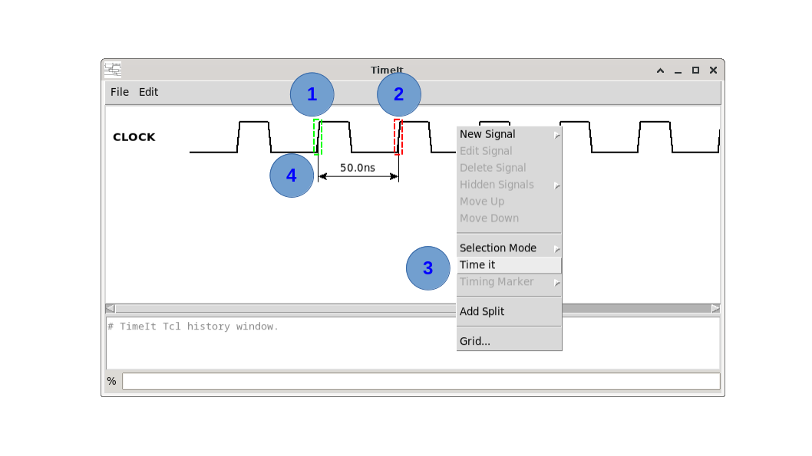
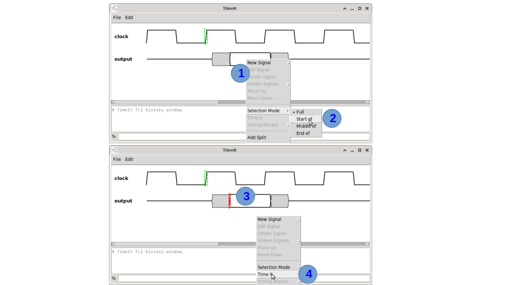
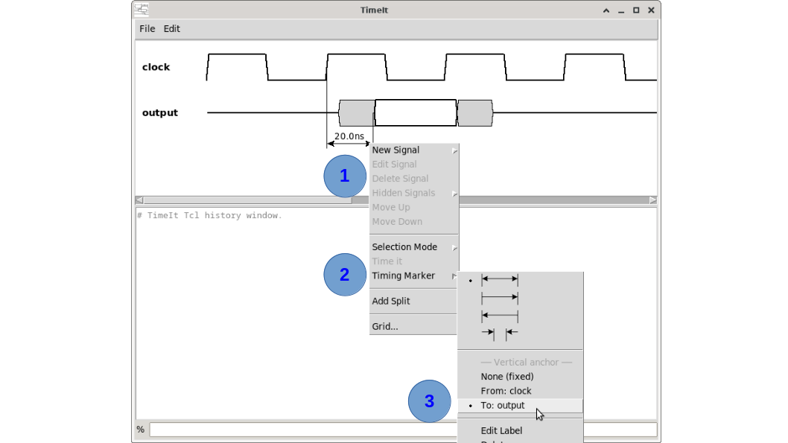
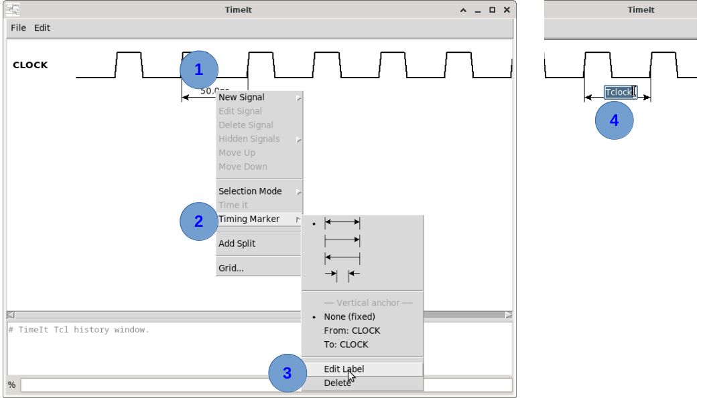
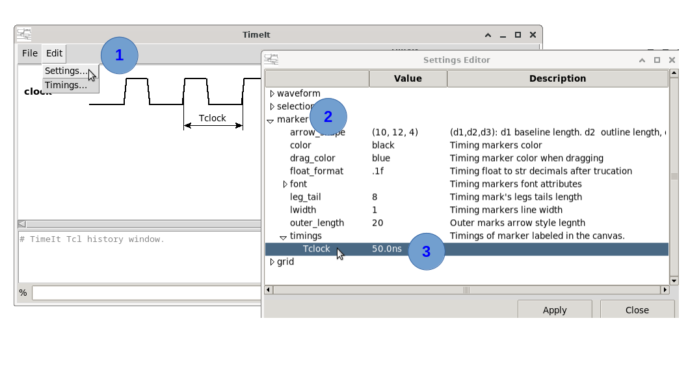
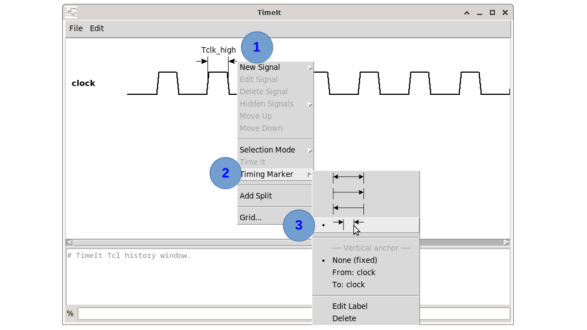
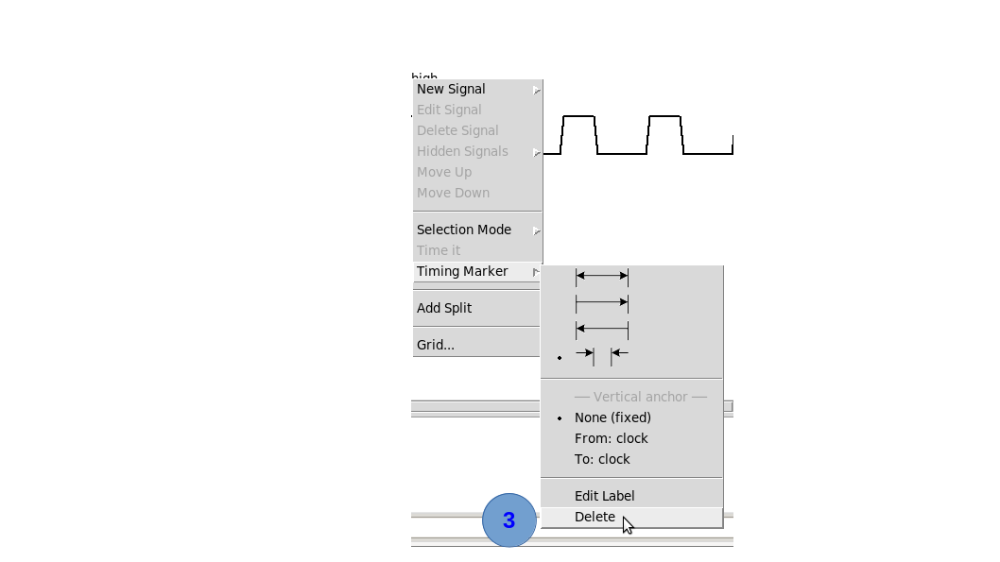

# How to create timing markers

Timing markers draw a measured arrow between two waveform points, annotating the time interval between them. Timing markers are usually created in the GUI. The associated command is `create_timing_marker` in the TCL console.

## GUI procedure



1. Select the marker's start-point. <kbd>Mouse Left-click</kbd> on the waveform transition (or shape) of interest. A green bounding-box (bbox) showing the selection will appear. Beware that other waveform shapes may be located at the same selection point. If the shape bbox is not the one desired, click again and the selection will shift to the next object in the area (rotating selection). 
2. Select the marker's end-point (by holding  <kbd>Ctrl</kbd> key down). <kbd>Ctrl-Mouse Left-click</kbd> on the waveform transition (or shape) of interest. A red bounding-box (bbox) showing the selection will appear. If the shape bbox selection is not the one desired, click again (holding <kbd>Ctrl</kbd> key down) and the selection will shift to the next object.   
3. Once start-point and end-point are selected, <kbd>Mouse Right-click</kbd> anywhere in the canvas to make the contextual menu appear and select "**TimeIt**". The timing maker will be created and its label will indicate the time value in between start and end points.  
4. To move the timing marker vertically, hover over one of its arrow tips, not the label. When the pointer icon changes, click and drag the marker to its new position.
5. (not shown in figure above). The timing marker label can also be moved. Hover over the label, when the mouse pointer icon changes, click and drag the label to diferent location.

----
### Marker selection mode
Sometimes it is required to set the selection mode **before** clicking the waveform point of interest. Example: From clock edge to "*start of*" data valid. In such a case it is necessary to set the selection mode to "**Start of**" when end-point is going to be selected as shown below.

 

1. **After** having selected the clock edge first and **before** selection the end-point. <kbd>Mouse Right-click</kbd> anywhere in the canvas to get the contextual menu.
2. Select "**Start of**" in the **Selection Mode** cascade menu.
3. Then, holding <kbd>Ctrl</kbd> key down, click on the waveform point of interest to select only the "*start of*" part. (The data valid in this example).
4. <kbd>Mouse Right-click</kbd> anywhere in the canvas to make the contextual menu appear and select "**TimeIt**"

----
### Marker relative position
By default, a timing marker has an absolute position on the canvas. If the waveforms move, the marker stays in place and may overlap other waveforms or annotations. To prevent this, the marker can be anchored to either the start-point or end-point waveform, so it moves together with the selected waveform.

 

1. <kbd>Mouse Right-click</kbd> over the timing marker.
2. Select "**Timing Marker**" cascade menu.
3. Select within the *--Vertical anchor--* menu section the signal name the marker shall be relative to.

----

### Renaming timing label
When first created the timing marker label shows the timing value number in between the start and end point. User can edit the label and provide a symbolic text.



1. <kbd>Mouse Right-click</kbd> over the timing marker label.
2. Select "**Timing Marker**" cascade menu.
3. Click on "**Edit Label**" menu entry
4. The label is now editable.

To get the timing values associated with the edited timing marker labels: From the menu bar select **Edit→Settings...** 



----
### Changing timing marker arrow style



1. <kbd>Mouse Right-click</kbd> over the timing marker label.
2. Select "**Timing Marker**" cascade menu.
3. Select the marker (arrow) style

----
### Delete timing marker



1. <kbd>Mouse Right-click</kbd> over the timing marker label.
2. Select "**Timing Marker**" cascade menu.
3. Select "**Delete**"


## Command syntax

```
create_timing_marker  -name name
                      -from select:uid
                      -to select:uid
                      [-at y_coord]
                      [-style (inner_both)|inner_right|inner_left|outer]
                      [-anchor (none)|from|to]
                      [-label_x rel_x]
                      [-label_y rel_y]
                      [-help]
```

## Key parameters

| Parameter | Description |
|---|---|
| `-name` | Marker label. Use `""` to display the measured time value directly; a non-empty name stores the value and displays the name instead. |
| `-from` | Start measurement point as `select:uid` (e.g. `end:uid_1_3`). |
| `-to` | End measurement point as `select:uid`. |
| `-at` | Y position of the marker line on the canvas (pixels). |
| `-style` | Arrow style (see below). Default: `inner_both`. |
| `-anchor` | `none` (absolute y), `from`, or `to` (y relative to the anchored signal slot). |
| `-label_x` | Horizontal offset of the label from the marker midpoint (px). |
| `-label_y` | Vertical offset of the label from the marker line (px). |

## Measurement point syntax: `select:uid`

The `select` part specifies which point on the waveform element to measure:

| Selector | Meaning |
|---|---|
| `full` | Mid-point of the full element bounding box |
| `start` | Left edge of the element bounding box |
| `end` | Right edge of the element bounding box |
| `middle` | Horizontal centre of the element bounding box |

`uid` is the unique tag of a waveform element (e.g. `uid_1_3`). UIDs are shown when you click on a waveform element in the canvas.

## Marker styles

| Style | Description |
|---|---|
| `inner_both` | Arrow line between the two legs, arrows on both ends (default) |
| `inner_right` | Arrow on right end only |
| `inner_left` | Arrow on left end only |
| `outer` | Two outward arrows pointing at the measurement points |

> **TODO:** Add a diagram or screenshot illustrating each of the four styles side by side.

## Step-by-step example

### 1. Display the measured time as the label

```tcl
create_timing_marker -name "" \
                     -from end:uid_1_2 \
                     -to start:uid_2_1 \
                     -at 80
```


### 2. Named marker (value stored for later use)

```tcl
create_timing_marker -name "tsu" \
                     -from end:uid_1_2 \
                     -to start:uid_2_1 \
                     -at 80 \
                     -anchor from \
                     -style inner_both
```

The value is stored in the timings dictionary and is accessible as `$tsu` in subsequent TCL expressions.


## How to find UIDs

Click on a waveform element in the canvas. The status bar (or console) will report the UID of the element under the cursor.

> ⚠️ **Warning:** Status bar messages and *get_...* facility commands are not implemented yet.

---

*Previous: [How to create input/output signal(s)](04_io_signals.md) | Next: [How to save and load](06_save_load.md)*
