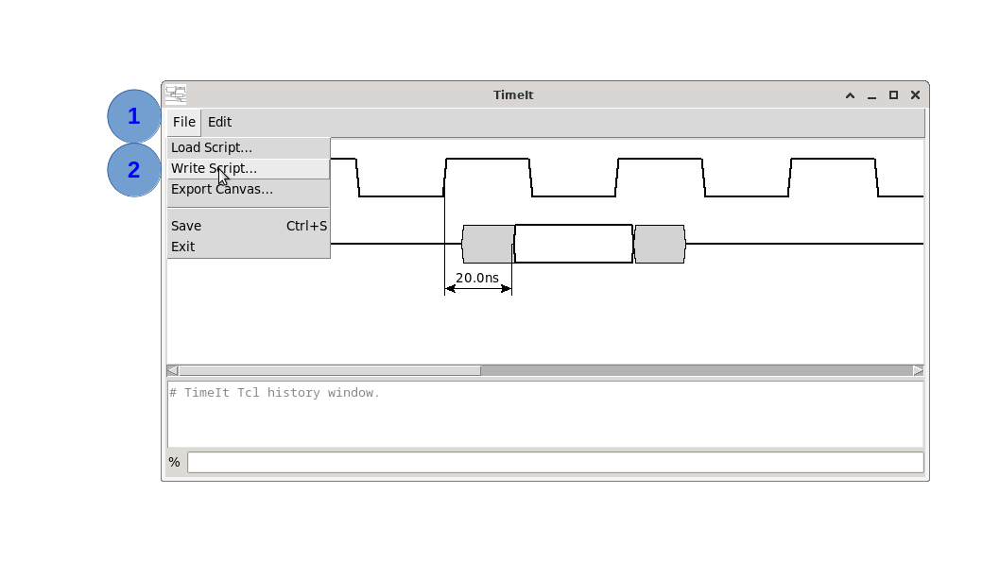
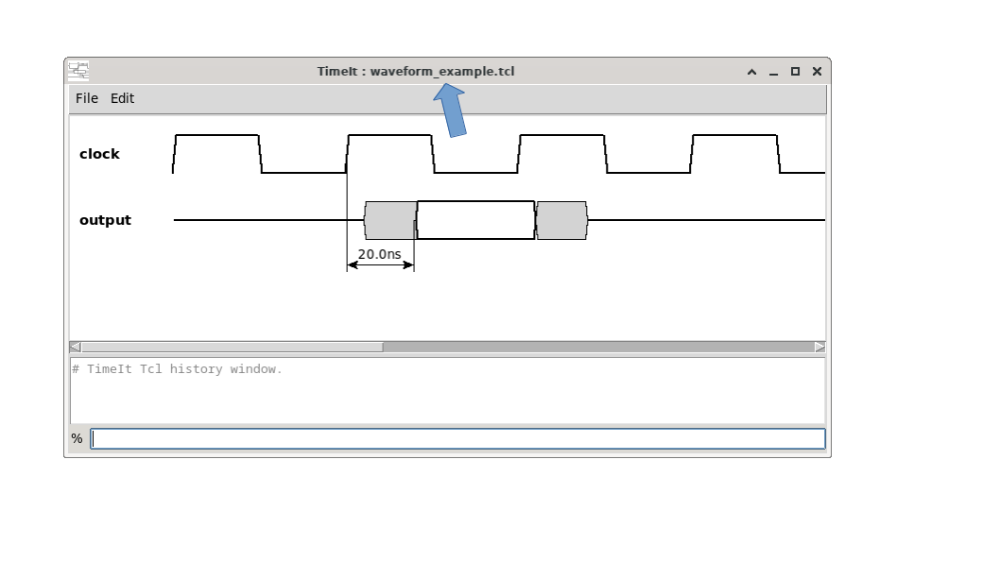

# How to save and load

TimeIt diagrams are stored as plain TCL script files. Any diagram you build in the console is fully reproducible by re-running the same script.

## Saving

### Via the menu

**File → Write Script...** writes the current diagram state to a `.tcl` file.



It is also possible to save by using <kbd>Shift-s</kbd>. Current TimeIt waveform file is shown in windows title bar.



### Via the TCL console

> ⚠️ **Warning:** There is no TCL command associated to **Write Script...** yet


## Loading

### Via the menu

**File → Load Script…** opens a file chooser. Select a previously saved `.tcl` file; TimeIt will execute it and reconstruct the diagram.

If the current session is not blank, TimeIt first asks for confirmation: loading a script clears everything — signals, timing markers, splits, annotations and variables (timing and user) — before the file content replaces it.

### Via the TCL console

You can source any TCL file from the console:

```tcl
source "my_diagram.tcl"
```

## Exiting with unsaved changes

When you exit (File → Exit or the window close button) and the diagram differs from its last saved (or loaded) state, TimeIt asks whether to save first: **Yes** saves and exits (opening the Write Script dialog if the session has no file yet), **No** exits without saving, **Cancel** returns to the application. View-only changes — resizing the window, zooming — do not count as modifications.

## Tips

- Because the save format is plain TCL, you can edit diagram files in any text editor.
- TCL variables (e.g. `set Fclk 100e6`) placed at the top of the file act as parameters — change a single variable to update all signals that reference it.
- Your own TCL variables (scalars and arrays created with a plain `set`, in the console or in a sourced script) are saved too: **Write Script...** emits them in a `# --- User variables ---` section at the top of the file, before anything that could reference them. Only the current *value* is saved — a variable set with `set a [expr {$b * 2}]` is written back as its computed result, not the expression. `remove -all` (the first command of every saved script) unsets them, so a loaded diagram never inherits the variables of the one it replaces.
- Keep scripts under version control (git) to track diagram history.

---

*Previous: [How to create timing markers](05_timing_markers.md) | Next: [How to show the background grid](07_grid.md)*
