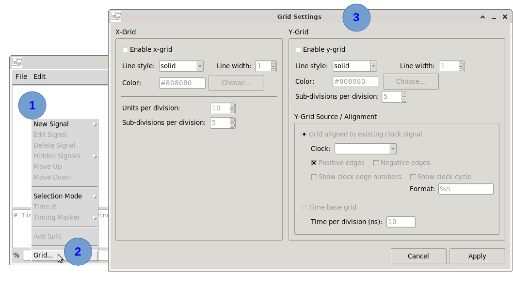
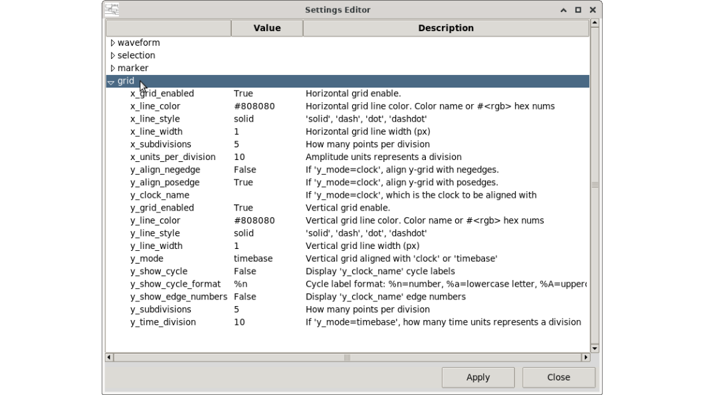

# How to show the background grid

The background grid helps align timing markers and visually read signal timing relationships.

## Enabling the grid

### Via the contextual menu
 

 
1. <kbd>Right-click</kbd> anywhere in the canvas to get the context menu
2. Select **Grid...** the grid dialog window shall appear.
3. Enable x-grid or/and y-grid and options at your convenience


### Via the TCL console

Grid options can be set by using a variables family group `settings.grid.*` :

```tcl
set_app_var -name settings.grid.x_grid_enabled -value {True}
set_app_var -name settings.grid.y_grid_enabled -value {True}
```
To know the full set of grid setting variables, open **Grid Settings** dialog window **Edit → Settings…** and expand "**grid**" group category.




---

*Previous: [How to save and load](06_save_load.md) | Next: [How to export the canvas](08_export.md)*
