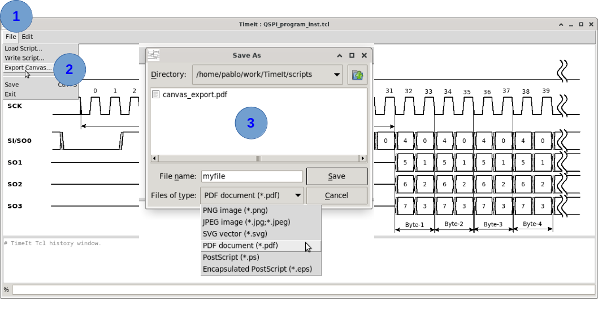

# How to export the canvas

TimeIt can export the timing diagram canvas to several image and vector formats for use in documents and presentations.

## Supported formats

| Format | Extension | Notes |
|---|---|---|
| PNG | `.png` | Raster image, suitable for web and office documents. Bitmap. |
| JPEG | `.jpg` | Raster image with lossy compression. Bitmap. |
| SVG | `.svg` | Scalable vector, ideal for technical documents. Vectorial. |
| PDF | `.pdf` | Portable vector format. Vectorial. |
| EPS | `.eps` | Encapsulated PostScript vector, common in LaTeX workflows. Vectorial. |
| PS | `.ps` | PostScript vector, common in LaTeX workflows. Vectorial. |

## Exporting via the menu

**File → Export Canvas…** opens an export dialog where you can choose the format and output path.

## Exporting via the TCL console

> ⚠️ **Warning:** There is no TCL command associated to **Export Canvas...** yet

## Tips

- **SVG and PDF** preserve full vector quality at any zoom level — prefer these for documentation.
- **PNG** is the most universally compatible raster format; use a high DPI setting if available.

- The exported image captures full canvas content. 

---

*Previous: [How to show the background grid](07_grid.md) | Next: [How to create timing annotations](09_annotations.md)*
