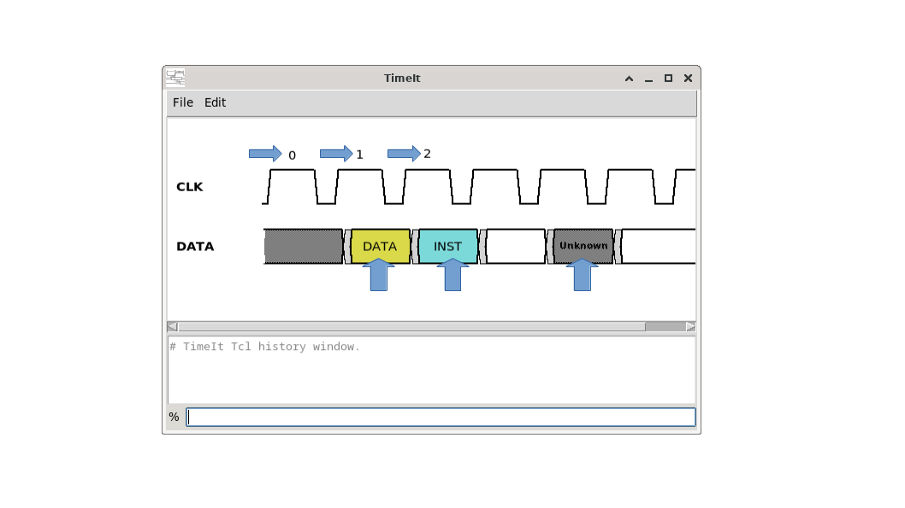
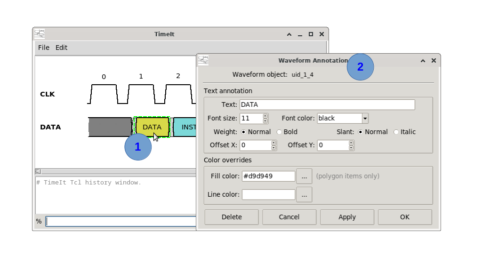

# How to create timing annotations

Waveform annotations attach text labels and/or colour highlights to specific waveform segments. Use `create_waveform_annotation` in the TCL console.

Example of what waveforms annotations are and do :



## GUI procedure

1. <kbd>Double-click</kbd> on the waveform segment/shape of interest. A dialog window will appear.
2. Fill the options



To edit or delete an existing waveform annotation just <kbd>Double-click</kbd> on it to open the annotation dialog window and modify/delete.

Annotations are **draggable** on the canvas. Click and drag to change annotation position. The position is always relative to the associated waveform element.  

## Command syntax

```
create_waveform_annotation -on wf_object
                           [-text text]
                           [-font_size font_size]
                           [-font_slant (normal)|italic]
                           [-font_weight (normal)|bold]
                           [-font_color font_color]
                           [-fill fill_color]
                           [-line line_color]
                           [-rel_x rel_x]
                           [-rel_y rel_y]
                           [-help]
```

## Key parameters

| Parameter | Description |
|---|---|
| `-on` | **Mandatory.** The UID tag of the waveform element to annotate (e.g. `uid_2_11`). |
| `-text` | Annotation text string. |
| `-font_size` | Text font size. |
| `-font_weight` | `normal` (default) or `bold`. |
| `-font_slant` | `normal` (default) or `italic`. |
| `-font_color` | Text colour: named colour (`black`, `blue`, …) or `#RRGGBB` hex code. |
| `-fill` | Fill colour for polygon waveform segments (data valid regions). |
| `-line` | Colour for the waveform element's outline. |
| `-rel_x` | Horizontal text offset from the element centre (px). |
| `-rel_y` | Vertical text offset from the element centre (px). |

## Removing an annotation

An annotation is identified by the waveform element it annotates — the very UID it was created with (`-on`):

```tcl
# Example:
remove -annotation {uid_2_11}
```

This is what the **Delete** button of the annotation dialog issues. An annotation is also removed together with the signal it is attached to (`remove -signal`).

## Behaviour

- An annotation is tied to its waveform element: deleting the signal also deletes its annotations.
- Annotations are **draggable** on the canvas.
- Double-clicking an annotation opens the edit dialog.
- Re-issuing the command with the same `-on` target **replaces** all annotation attributes (not incremental).
- The command is rejected if the UID resolves to multiple items or to a non-signal element.

## Step-by-step example

### 1. Simple text label on a data segment

```tcl
create_waveform_annotation -on uid_2_11 -text "DATA A"
```


### 2. Coloured fill with bold label

```tcl
create_waveform_annotation -on uid_2_11 \
                           -text "ADDR" \
                           -font_weight bold \
                           -font_color "#0000FF" \
                           -fill "#E0E8FF"
```

### 3. Highlight without text (colour only)

```tcl
create_waveform_annotation -on uid_3_5 \
                           -fill "#FFE0E0" \
                           -line "red"
```

## How to find UIDs

Click on a waveform element in the canvas. The UID is shown in the status bar or echoed in the console.

> ⚠️ **Warning:** Status bar messages and *get_...* facility commands are not implemented yet.

---

*Previous: [How to export the canvas](08_export.md) | Next: [How to copy a signal](10_copy_signal.md)*
