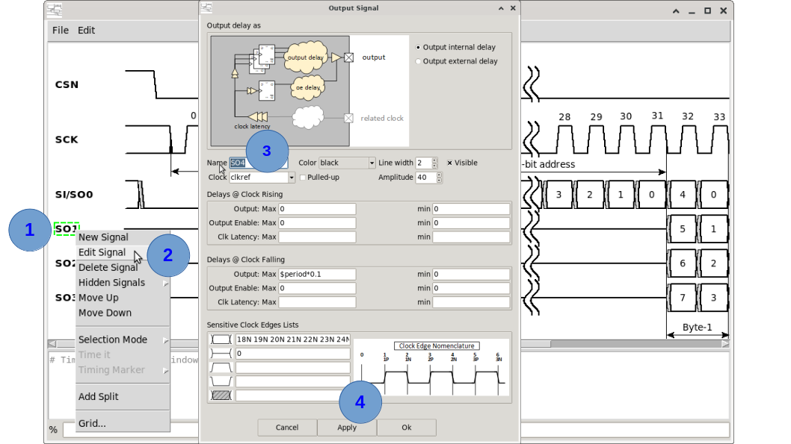
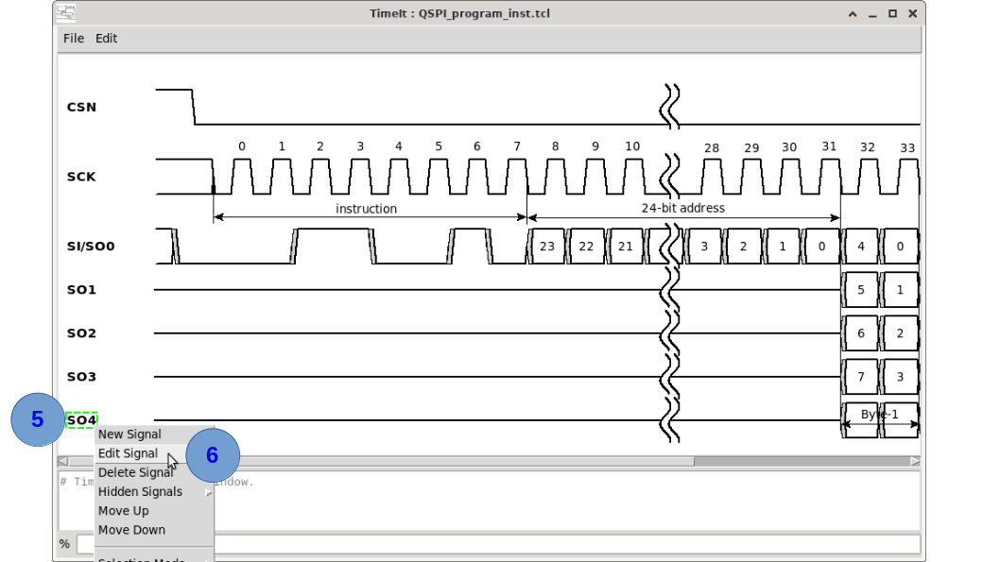

# How to copy a signal

Copying a signal lets you duplicate an existing waveform definition as the starting point for a similar signal, avoiding the need to retype all parameters.

Signals have a unique name. It is not possible to have two signals with the same name. 

## Via the canvas context menu

1. **Right-click** on the signal label or waveform row you want to copy.
2. Select **Edit Signal** from the context menu.
3. In the signal dialog window change the **Name** to the new signal name
4. Click **Apply**

5. The new signal will appear at the bottom.
6. **Right-click** on the newly created signal label and **Edit Signal** if it requires modificaiton

## Via the TCL console

The most reliable way to copy a signal is to retrieve and re-issue its definition with a new name. You can read the current signal definition with:

A manual copy workflow:

1. Open the saved `.tcl` file in a text editor.
2. Duplicate the relevant `create_clock` / `create_input` / `create_output` line.
3. Change the `-name` parameter.
4. Source the modified file or paste the new command into the console.

## Tips

- After copying, use the **Edit Signal**  dialog (Right-click on signal name) or re-issue the create command with updated parameters to differentiate the copy.
- If you only want to change the colour or amplitude of a copy, the `-color` and `-amplitude` flags on the create command are the quickest path.

---

*Previous: [How to create timing annotations](09_annotations.md) | Next: [How to move a signal](11_move_signal.md)*
