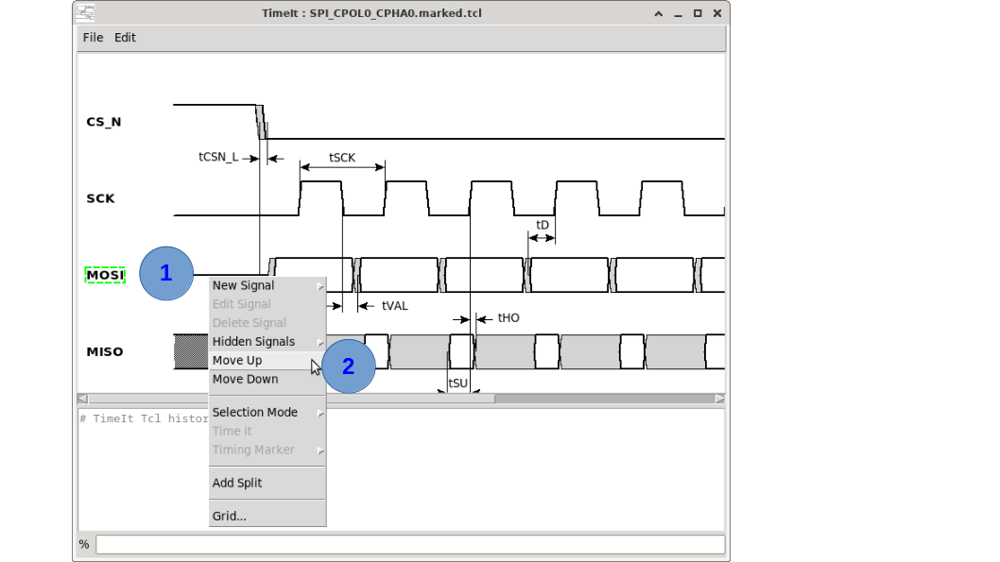

# How to move a signal

Signals can be reordered vertically in the canvas to arrange the diagram in a logical reading order.

## Via the canvas context menu




1. **Right-click** on the signal label or waveform row you want to move.
2. Select **Move Up** or **Move Down** from the context menu.
3. Repeat until the signal is in the desired position.

## Via drag-and-drop

> ⚠️ **Warning:** Moving signal strips by drag-and-drop is not implemented yet.

## Via the TCL console

The `move_signal` command moves a signal one position up or down, exactly as the context menu does:

```tcl
# Example:
move_signal -name clk    -direction down
move_signal -name {data} -direction up
```

Repeat the command to move a signal by more than one position. A signal that is already at the top (`up`) or at the bottom (`down`) of the diagram stays where it is; this is not an error.

Signals are otherwise displayed in the order they are created, so a script that does not use `move_signal` shall create them in the order they are meant to appear.

### Signals that can not be moved

A signal must always stay **below the clocks it refers to**, so a move that would break that rule is refused (with a dialog when done from the menu, with an error in the console when done with the command):

- an input/output signal can not be moved above its launch or capture clock;
- a clock can not be moved below a signal it launches or captures, nor below a clock generated from it.

The reference clock may be **hidden** and still forbid the move.

## Tips

- Moving a signal up or down also moves all of its timing markers and annotations that are anchored to it.
- The order of signals in the canvas reflects the order they appear in the saved `.tcl` file — you can also reorder them by editing the file directly.

---

*Previous: [How to copy a signal](10_copy_signal.md) | Next: [How to delete a signal](12_delete_signal.md)*
