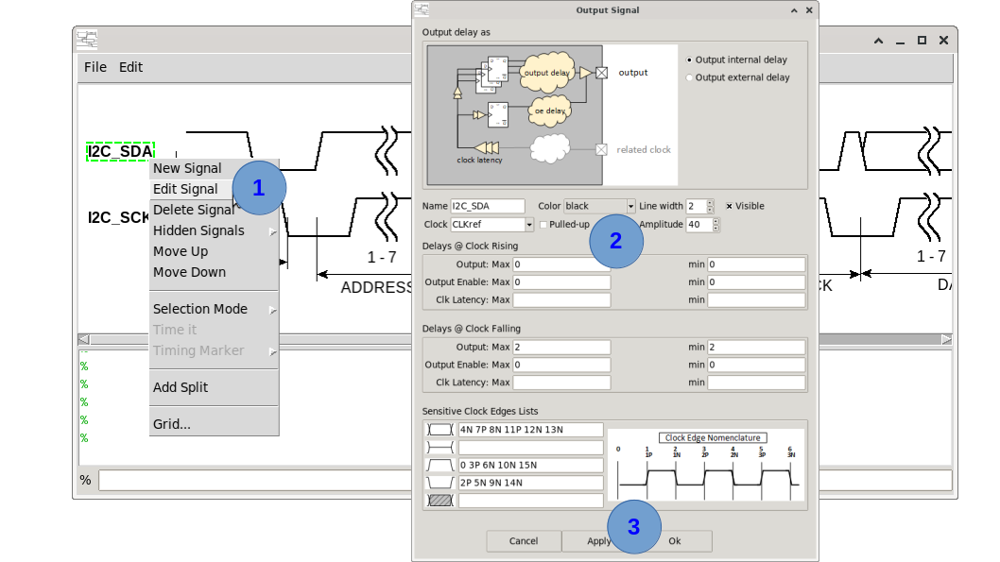
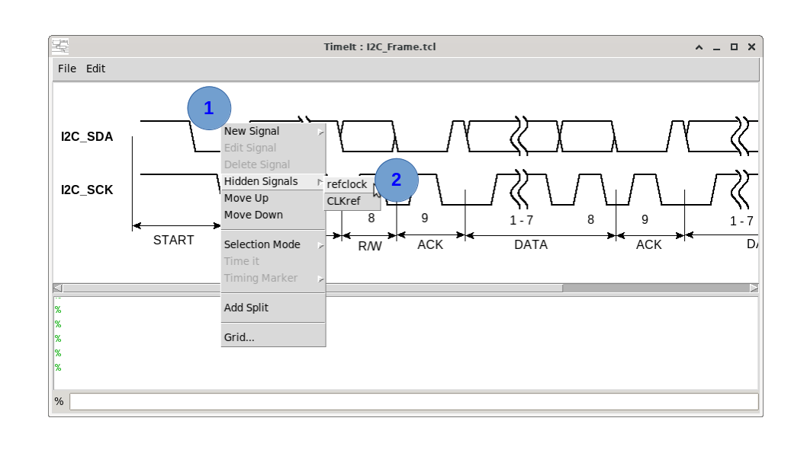

# How to modify a signal

There are two ways to modify an existing signal: the graphical edit dialog and re-issuing the create command from the TCL console.

---

## Method 1 — Edit dialog (GUI)



1. <kbd>Right-click</kbd> the signal label on the left side of the canvas.  
   The signal edit dialog opens, pre-populated with the current signal parameters.
2. Update the fields you want to change.
3. Click **OK** (or **Apply**) to redraw the signal with the new values.

---

## Method 2 — Re-issue the create command (TCL console)

Re-running `create_clock`, `create_input`, or `create_output` with the **same** `-name` updates the signal in place.

```tcl
# Change the clock colour and amplitude
create_clock -name clk \
             -period {10} \
             -color green \
             -amplitude 50 \
             -visible

# Change input delays
create_input -name data_i \
             -refclock clk \
             -specify internal \
             -rclk_inputdly_max {4.0} \
             -rclk_inputdly_min {1.5} \
             -data_edges {1P 2P} \
             -visible
```

---

## Visibility toggle

To show or hide a signal without deleting it:

- **GUI:** Show-up the signal dialog window by <kbd>Right-click</kbd> the signal label on the left side of the canvas. Uncheck the **Visibility** check-box.
- **Console:** Re-issue the create command with or without the `-visible` flag.

To show hidden signals in the canvas: <kbd>Right-click</kbd> anywhere in the canvas and select the cascade menu **Hidden Signals**. Click on the hidden signal name in the list (if any) to toggle its visibility attribute.



---

## Common modifications

| Goal | How |
|---|---|
| Change colour | `-color green` (or other colour) in the create command |
| Change amplitude | `-amplitude 60` in the create command |
| Change line width | `-lwidth 3` in the create command |
| Change period (clock) | `-period {new_expr}` in the create command |
| Change edge list (input/output) | Update `-data_edges`, `-hiz_edges`, etc. |
| Rename a signal | Delete it and re-create with the new name (rename-in-place is not currently supported) |

---

*Previous: [How to delete a signal](12_delete_signal.md) | Next: [How to lay out signals in the canvas](14_layout.md)*
