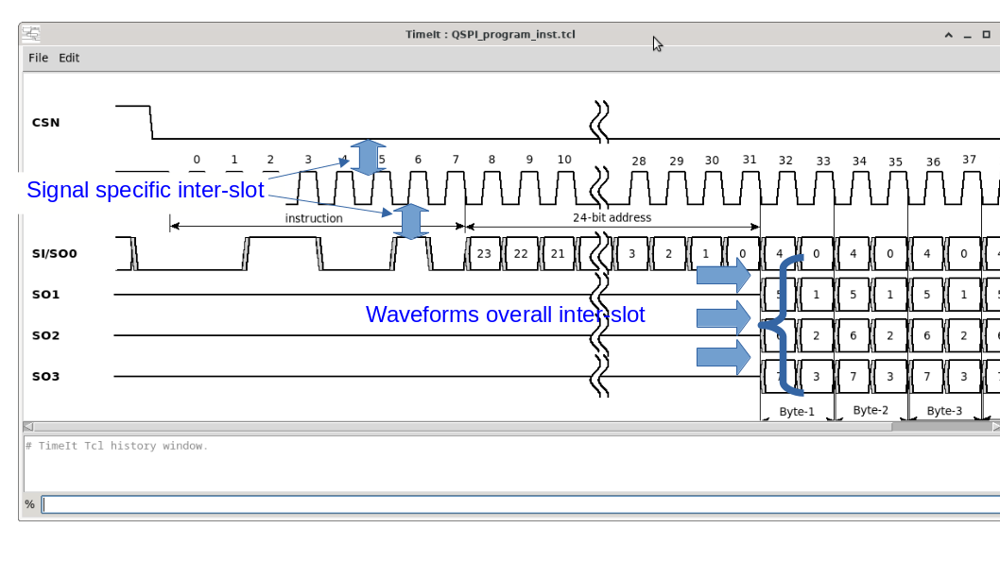
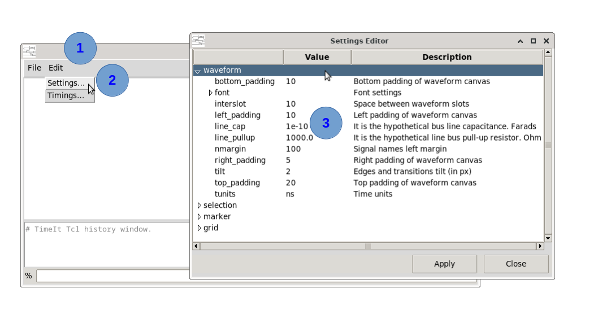
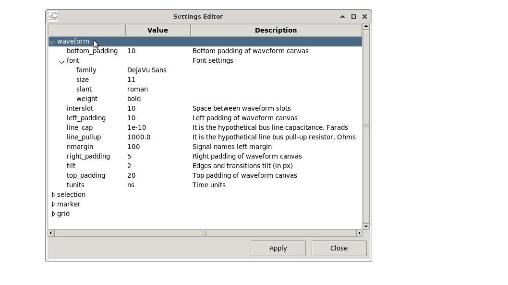
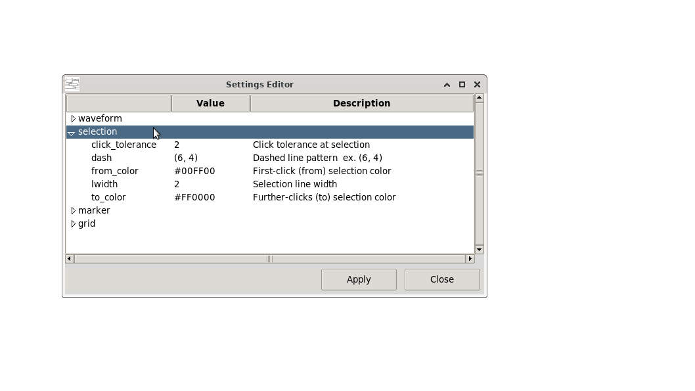
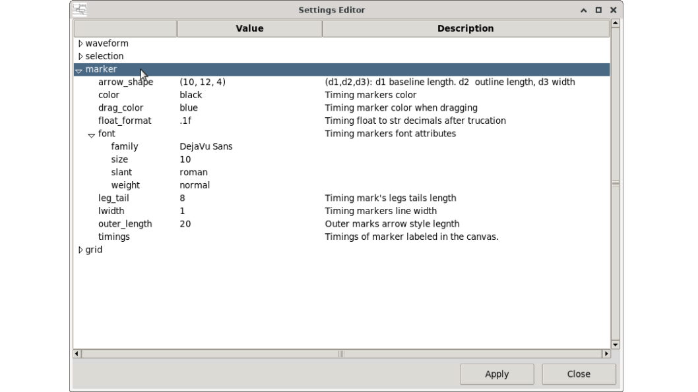
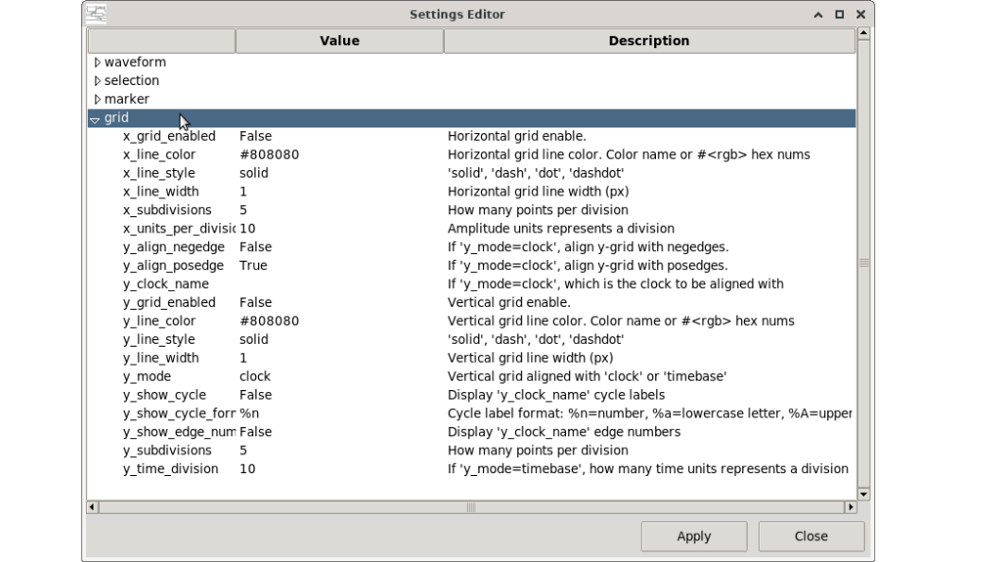

# How to lay out signals in the canvas (waveform settings)

The Waveform Settings dialog controls the global layout of all signals on the canvas: padding, slot height, inter-signal spacing, font, and more.

The waveform settings applies to all waveforms. 
While inter-slot spacing is the same for all signal canvas rows/strips, there is a particular case when a signal requires more inter-slot spacing (individually). This is illustrated in the following screenshot:




When a signal requires more spacing (top spacing), there is signal attribute (`top_padding`) that it is added to the overall inter-slot spacing. The attribute can only be set by using the TCL command `set_attribute`:

```tcl
# Example illustrated above.
set_attribute -signal {SCK} \
       -name top_padding  -value 30

set_attribute -signal {SI/SO0} \
       -name top_padding  -value 30

```
By using the `top_padding` signal attribute, it is possible to give more spacing to individual signals if necessary.


## Opening the settings dialog

**Edit → Settings…** 



## Settings overview

The settings are grouped in families.

- The **waveform** group : Waveform appearance settings 


- The **selection** group : Selection bbox appearance 


- The **marker** group: Timing marker appearance



- The **grid** group: Grid appearance




## Applying settings via the TCL console

Settings can also be changed programmatically:

```tcl
set_app_var -name settings.waveform.tilt -value {2}
set_app_var -name settings.waveform.nmargin -value {100}
set_app_var -name settings.waveform.interslot -value {10}
set_app_var -name settings.waveform.top_padding -value {20}
set_app_var -name settings.waveform.bottom_padding -value {10}
set_app_var -name settings.waveform.left_padding -value {10}
set_app_var -name settings.waveform.right_padding -value {5}
set_app_var -name settings.waveform.font.family -value {DejaVu Sans}
set_app_var -name settings.waveform.font.size -value {11}
set_app_var -name settings.waveform.font.weight -value {bold}
set_app_var -name settings.waveform.font.slant -value {roman}
set_app_var -name settings.waveform.tunits -value {ns}
set_app_var -name settings.waveform.line_pullup -value {1000.0}
set_app_var -name settings.waveform.line_cap -value {1e-10}
set_app_var -name settings.selection.click_tolerance -value {2}
set_app_var -name settings.selection.from_color -value {#00FF00}
set_app_var -name settings.selection.to_color -value {#FF0000}
set_app_var -name settings.selection.lwidth -value {2}
set_app_var -name settings.selection.dash -value {6,4}
set_app_var -name settings.marker.lwidth -value {1}
set_app_var -name settings.marker.color -value {black}
set_app_var -name settings.marker.drag_color -value {blue}
set_app_var -name settings.marker.font.family -value {DejaVu Sans}
set_app_var -name settings.marker.font.size -value {10}
set_app_var -name settings.marker.font.weight -value {normal}
set_app_var -name settings.marker.font.slant -value {roman}
set_app_var -name settings.marker.leg_tail -value {8}
set_app_var -name settings.marker.outer_length -value {20}
set_app_var -name settings.marker.arrow_shape -value {10,12,4}
set_app_var -name settings.marker.float_format -value {.1f}
set_app_var -name settings.grid.x_grid_enabled -value {False}
set_app_var -name settings.grid.y_grid_enabled -value {False}
set_app_var -name settings.grid.x_line_style -value {solid}
set_app_var -name settings.grid.x_line_width -value {1}
set_app_var -name settings.grid.x_line_color -value {#808080}
set_app_var -name settings.grid.x_units_per_division -value {10}
set_app_var -name settings.grid.x_subdivisions -value {5}
set_app_var -name settings.grid.y_mode -value {clock}
set_app_var -name settings.grid.y_line_style -value {solid}
set_app_var -name settings.grid.y_line_width -value {1}
set_app_var -name settings.grid.y_line_color -value {#808080}
set_app_var -name settings.grid.y_subdivisions -value {5}
set_app_var -name settings.grid.y_clock_name -value {}
set_app_var -name settings.grid.y_align_posedge -value {True}
set_app_var -name settings.grid.y_align_negedge -value {False}
set_app_var -name settings.grid.y_show_edge_numbers -value {False}
set_app_var -name settings.grid.y_show_cycle -value {False}
set_app_var -name settings.grid.y_show_cycle_format -value {%n}
set_app_var -name settings.grid.y_time_division -value {10}
```


## Tips

- Increase `interslot` to create more breathing room between signal rows, which is helpful when placing timing markers between adjacent signals.
- Changing `top_padding` while using anchored timing markers (see [Timing markers](05_timing_markers.md)) keeps markers aligned with their signals automatically.
- After changing layout settings, all signals are redrawn — there is no need to re-source the script.

---

*Previous: [How to modify a signal](13_modify_signal.md) | Next: [How to see command help notices](15_command_help.md)*
