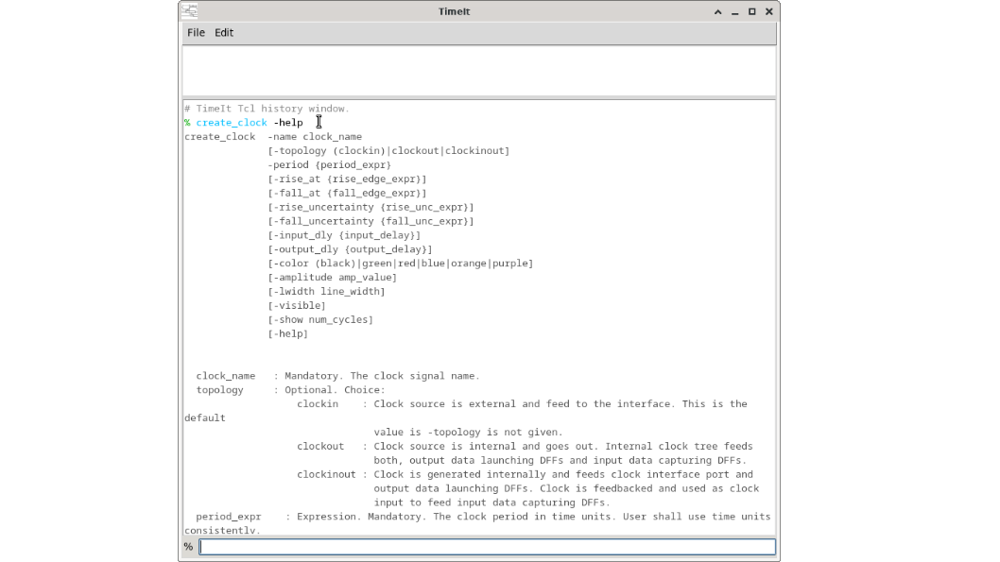

# How to see command help notices

Every TCL command in TimeIt has a built-in help notice that describes its syntax, options, and examples.

## Getting help for a specific command

Add the `-help` flag to any command in the TCL console:

```tcl
create_clock -help
create_input -help
create_output -help
create_timing_marker -help
create_waveform_annotation -help
```

The help text is printed directly in the console output area.




## Listing all available commands


```tcl
# Example:
help
```

> ⚠️ **Warning:** `help` command is not yet implemented.

## Tips

- The `-help` flag works even if other mandatory arguments are missing — you do not need to fill in a full command just to read its help.
- The same help text is stored as plain `.txt` files in the `data/` directory of the TimeIt installation, so you can also read them in any text editor.

---

*Previous: [How to lay out signals in the canvas](14_layout.md) | Back to [Introduction](00_introduction.md)*
