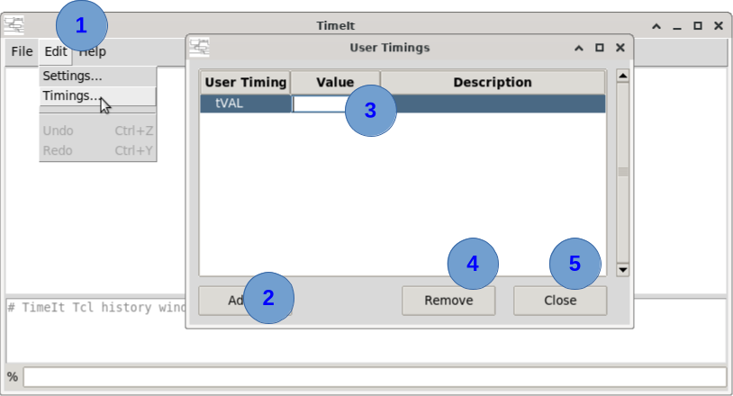
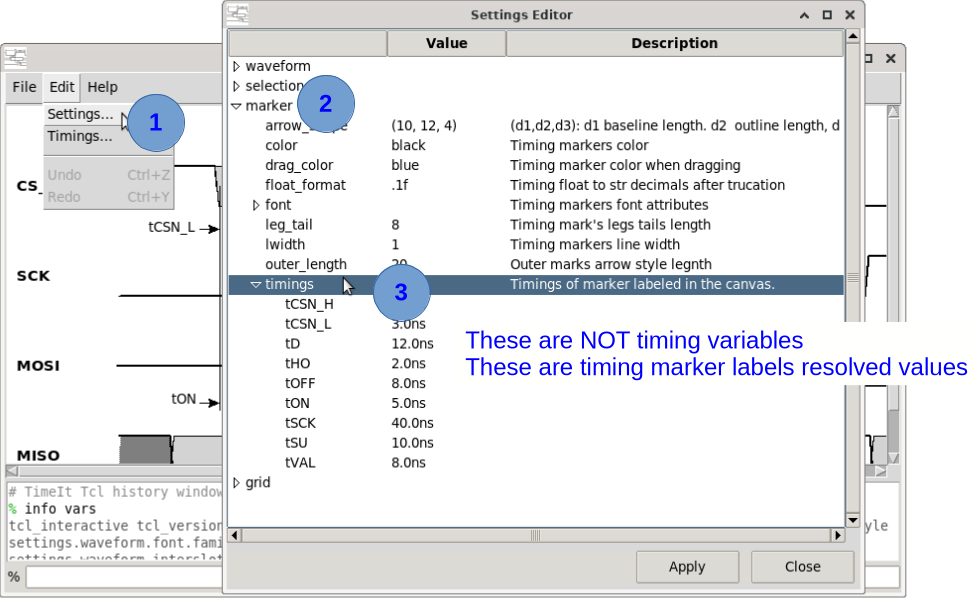

# How to use timing variables

Imagine the following situation. You have built a timing diagram by using numerical values for clock definition values (period, rising and falling edge timing, uncertainty values, delays, etc...) and then you realize that due to implementation or lab measures values are different and some delays show dependencies with other values. To re-work a complex timing diagram with numerical values is time consuming and error prone. 

The solution is to create a library of variables that may contain expressions or constants and use them in to build your timing diagram. If a value change, for example a clock period, you just need to update your `period` variable and your waveforms will populate and redraw with the new updated values. That is the magic of using timing variables. It is just a good practise when specifying your waveforms.

## What is it ? 

Timing variables are named values you can use anywhere a timing is expected: a clock period, an edge time, an uncertainty, an input/output delay, a latency. Instead of scattering raw numbers over your diagram, you name them once and refer to them simply as `$name`.

They are worth using for four reasons:

- **A diagram becomes parametric.** Change `Tclk` and every clock, delay and marker that refers to it follows on the next redraw.
- **A diagram becomes readable.** `-rclk_inputdly_max {$tSU}` says what it means; `-rclk_inputdly_max {2.4}` does not.
- **They are saved with the diagram.** Timing variables are written back into the saved script. Plain TCL variables (`set tSU 2.4`) are **not**: they are lost on save and the script will fail to resolve when it is reloaded. This is the main reason to prefer them.
- **You can make expressions** with them. Imagine that you want to specify a delay as 10% of the clock period, just simply write: `$tPERIOD*0.1` or if you want your delay percentage to be variable: `$tPERIOD*$dly_pct/100`. 

**Note:** a timing variable holds a plain number in the current time units — see *Waveforms Settings* (**Edit→Settings...**). It carries no unit of its own, so all your values must be consistent.

---

## GUI procedure



1. Open **Edit→Timings…**. The *User Timings* window lists every timing variable with its value and its description.
2. Press **Add…** and give the variable a name. The name is what you will refer to in expressions, as `$name`.
3. Click on the **Value** cell to edit it, and on the **Description** cell to document what the variable is for. Press <kbd>Enter</kbd> to commit.
4. Press **Remove** to delete the selected variable.
5. Press **Close** when done.

The canvas is redrawn as soon as a value is committed, so you can watch the diagram follow the value you are editing. The window is not modal: you can leave it open next to the canvas while you work.

Timing variables should be created **before** the signals that use them (see *How they are evaluated* below).

---

## Command syntax

Timing variables are application variables, created with `set_app_var` under the `timings.` prefix:

```
set_app_var  -name timings.var_name
             -value {value_expr}
             [-desc {description}]
```

### Key parameters

| Parameter | Description |
|---|---|
| `-name` | **Mandatory.** `timings.` followed by the variable name. The variable is then referred to as `$var_name` (without the `timings.` prefix) in any timing expression. |
| `-value` | **Mandatory.** The value, as a TCL expression. It may be a plain number (`{10}`), or an expression referring to timing variables already defined (`{$Tclk/2.0}`). |
| `-desc` | Optional. Free text describing the variable, shown in the *User Timings* window. |

### Removing a timing variable

A timing variable is removed by **name** (without the `timings.` prefix), with the `remove` command:

```tcl
# Example:
remove -timing_var {tSU}
remove -timing_var {tSU tHO}
```

The variable is dropped from the diagram and unset in the TCL interpreter. This is what the **Remove** button of the *User Timings* window issues.

> ⚠️ **Warning:** A signal whose timings refer to a removed variable can not be drawn any more, and is dropped from the diagram together with the variable — along with the timing markers measuring it. Remove a variable only once nothing refers to it.

`remove -all` also clears every timing variable, so loading a diagram never inherits the variables of the one it replaces.

---
## DO NOT confuse with timing markers labels

When creating timing markers, the user is free to either let the numerical value of the timing (default label value at creation) or give a symbolic timing label for illustration purposes. The name of the label has nothing to do with "timing variables" of course the user can label a timing marker the same way of the "timing variable", but the tool will not make the association they are different objects. 

If user is interested to get the numerical timing value of a timing marker label
1. Open **Edit→Settings…**.
2. Navigate tree, click on  **marker** and then ...
3. Click on the **timings** 


Example shown in the following screenshot: 
 

What it is shown are NOT timing variables but the numerical values of the names (labels) given to the timing marker.

---

## How they are evaluated

Two different moments, and the distinction explains most of the behaviour:

- **The variable itself is evaluated when it is set.** `-value {$Tclk/2.0}` is resolved there and then, so any variable it refers to must already exist. This is why **definition order matters**, and why the variables are re-evaluated in that same order whenever they are reloaded.
- **A signal keeps the expression, not the number.** `create_clock -period {$Tclk}` stores the string `$Tclk` and resolves it at every redraw. That is what makes the diagram parametric: change the variable, and every signal referring to it moves.

So a diagram is built in this order: timing variables first, then the signals that use them.

---

## Step-by-step example

An SPI-like interface where everything derives from the clock period:

```tcl
set_app_var -name timings.Tclk \
   -desc {Clock period} \
   -value {10}

set_app_var -name timings.Thalf \
   -desc {Half period (duty cycle 50%)} \
   -value {$Tclk/2.0}

set_app_var -name timings.tSU \
   -desc {Setup requirement of the receiving device} \
   -value {2.0}

set_app_var -name timings.tHO \
   -desc {Hold requirement of the receiving device} \
   -value {1.0}

create_clock -name clk \
             -topology source \
             -period {$Tclk} \
             -rise_at {0} \
             -fall_at {$Thalf} \
             -visible

create_output -name data_o \
              -specify external \
              -launch_clock clk \
              -data_edges {1P 2P 3P} \
              -rclk_outputdly_max {$tSU} \
              -rclk_outputdly_min {-$tHO} \
              -visible
```

Re-open **Edit→Timings…**, set `Tclk` to `20`, and the clock, the data windows and every timing marker measuring them all follow.

---

## Notes

- Timing variables are the only variables written back when a diagram is saved. If a script uses a plain `set` variable in a timing expression, that expression will not resolve when the script is reloaded, the signal will be dropped, and any timing marker measuring it will be dropped with it.
- Changing a value from the console with `set_app_var` and no `-desc` keeps the description the variable already had. Pass an empty `-desc {}` to clear it.
- `set_app_var -help` prints the full built-in reference in the console.
- A signal whose timing expression can not be resolved (an unknown variable, a syntax error) is reported in the console and is not drawn.

---

*Previous: [How to scale waveform canvas](16_scale_canvas.md) | Back to [Introduction](00_introduction.md)*
