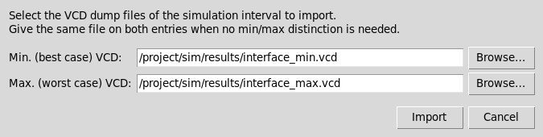
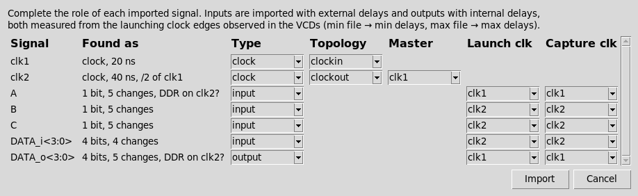
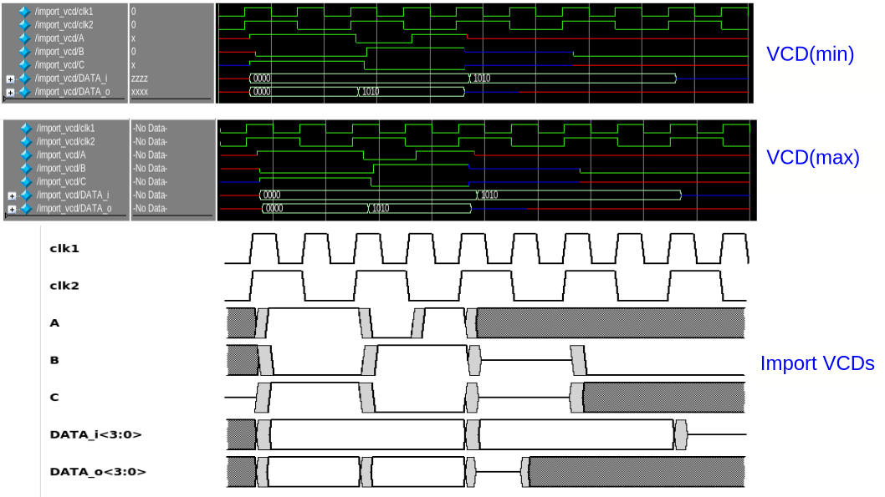

# How to import VCD dump files

**File → Import VCDs…** reproduces in TimeIt the waveforms of a real HDL (or gate-level) simulation, from VCD (Value Change Dump, IEEE 1364) files written by the simulator. The imported signals are regular TimeIt clocks, inputs and outputs — after the import they can be edited, annotated, measured, saved and exported like any hand-made diagram.

## Use model

1. In the simulator, isolate the **bundle of signals of interest** and a **time interval** representative of the timing diagram to capture (a few clock cycles showing the transfers).
2. Dump that interval into **two VCD files**:
   - a **min** file, from the best-case simulation corner (minimum delays), and
   - a **max** file, from the worst-case corner (maximum delays).

   If no min/max representation is wanted, give the **same file on both entries**.
3. Select **File → Import VCDs…** and pick the two files:

   

TimeIt parses both files, checks their consistency, and opens the signal characterization dialog described below. The classification found (clocks, derived clocks, data signals, delay ranges) is also printed in the console.

## Consistency checks

The pair is refused (with the reasons in the console and a dialog) when:

- The two files have **no signal in common**. Signals present in only one file are discarded with a warning.
- **No clock is detected**: at least one periodic, undistorted clock signal must be present (a 1-bit signal alternating 0/1 with a constant period).
- A clock is **distorted** between the files: the period must be identical in min and max. The first edge may be right-shifted in the max file (latency), and the duty cycle may differ — both are accepted and represented as clock uncertainty.
- A data signal shows a **different value sequence** in the two files (the dumps do not come from the same stimulus), or a change happens **earlier in the max file** than in the min one: every max delay must be greater than or equal to its min counterpart.

If the time intervals differ, the **shortest** one is used (with a warning). Different `$timescale` units between the files are fine — times are normalized before comparing.

## The signal characterization dialog

The VCD tells *when* signals change, but not their role in the interface. The dialog lists every common signal with the characteristics found and proposes a role; complete or correct them, then press **Import**:



- **Type** — `clock`, `input` or `output`. Periodic signals are proposed as clocks (a clock candidate may be demoted to input/output, e.g. a periodic enable). Direction is guessed from the name (`*_o`, `*out` → output); correct it as needed.
- **Topology** (clocks) — `clockin`/`source` for a source clock, `clockout`/`clockinout` for a generated one. Detected derived clocks (period an integer multiple of a faster clock, edges aligned on it) are proposed as `clockout` with their **Master** pre-selected. A derived candidate may also be imported as an independent source clock.
- **Launch clk / Capture clk** (inputs and outputs) — the proposal is the clock whose edges best explain the signal's transitions; the capture clock defaults to the launch clock. Launch and capture must be related (share the same source clock).

Only the knobs that apply to the chosen type are shown. Inconsistent choices (no clock kept, unrelated launch/capture, generated clock without a usable master...) are reported and the dialog stays open.

### The `DDR on <clock>?` hint

A signal whose changes all follow one edge polarity of a fast clock *also* follows **both** edges of a related clock at half the rate — the two readings draw identical waveforms, and the VCD cannot tell them apart. When this happens the dialog marks the signal with `DDR on <clock>?` in the **Found as** column (and a console warning). The single-edge reading is proposed; if the signal is really DDR, select the slower clock as its launch clock — the delays then split into rising-edge and falling-edge values automatically.

## How the waveforms are converted

- **Clocks** become `create_clock` commands. Source clocks carry the observed period, rise/fall times and, when the max file shows a shifted first edge or a different duty, the difference becomes `-rise_uncertainty` / `-fall_uncertainty`. Derived clocks become generated clocks (`-divide_by` or `-edges` on their master, `-invert` for clocks starting high).
- **Inputs** are created with `-specify external` and **outputs** with `-specify internal` — the two specifications whose delays run *forward from the launching clock edge*, which is exactly what the VCD shows. Each transition is assigned to the last launch clock edge at or before it; its delay is measured in the min file against the min-file edge and in the max file against the max-file edge.
- **Values map to edge lists**: single-bit `1`/`0` → `-high_edges`/`-low_edges`; multi-bit values → `-data_edges`; `X`/`U` (unknown/uninitialized) → `-unknown_edges`; `Z` → `-hiz_edges`. The value at the start of the interval becomes the `0` (waveform start) pseudo-edge. On outputs, transitions to/from Hi-Z feed the output-enable delays (`-*_oedly_*`).
- Bus bit ranges are kept in the signal name using angle brackets (`DATA<3:0>`).

The commands are executed through the console (so the import is visible in the log and lands in saved scripts like any other signal), and the whole import is **one undo step**.

### The delay envelope

TimeIt keeps **one min/max delay pair per signal and edge polarity**, while the VCD may show a different delay on every transition. The importer then uses the envelope — the smallest min-file delay and the largest max-file delay — and warns:

```
Import VCDs warning: 'A': per-transition rclk delays differ by up to 2 ns — the [2..6] ns envelope is used.
```

Note that this happens **even when the same file is given for min and max**: transition-to-transition variation inside a single simulation also widens the envelope, and the drawn transition bands then show that variation, not a min/max corner spread (the warning says so explicitly in that case).

### Result

Importing the example pair shipped in `data/VCDs/` (`import_vcd.min.vcd` / `import_vcd.max.vcd`) with the proposed roles gives:



## Limitations

- Per-transition delays collapse into the envelope described above.
- Min/max differences of a **generated** clock (latency, duty) can not be represented on it (generated clocks do not draw uncertainties) — a warning is issued; import the clock as a source clock if the uncertainty matters.
- Clock latency represented as uncertainty is drawn centered on the edge (peak-to-peak), while the real shift is one-sided.
- Real-valued VCD signals are ignored, and `$dumpoff` blocks are skipped (both with a warning).
- The DDR/SDR ambiguity is inherent to the VCD format: the proposal may need the manual correction described above.

## Tips

- Dump only the signals and the interval of interest: a shorter, cleaner dump gives a more readable diagram (the number of drawn cycles follows the dump length).
- Two simulation corners with the same stimulus and the same dump window make the min/max comparison meaningful; re-use the very same testbench for both runs.
- After importing, save the diagram (**File → Write Script…**): the imported signals are saved as regular `create_*` commands and no longer need the VCD files.

---

*Previous: [How to write an SDC constraint file](18_write_sdc.md) | Next: [How to create PWL (analog) signals](20_pwl_signals.md) | Back to [Introduction](00_introduction.md)*
