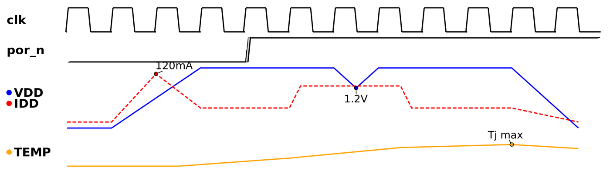

# How to create PWL (analog) signals

PWL signals bring arbitrary analog quantities into a timing diagram: supply voltages, currents, power, temperature… anything given as a **piece-wise linear** waveform. They are documentation signals: they refer to no clock, they are excluded from the SDC generation and from the VCD import, and timing markers cannot (yet) be placed on them.

A PWL signal is read from a `.pwl` text file and drawn in a **waveform slot** (strip). A single slot may show **several PWL signals** at once, for instance a supply voltage together with its current, or all the supply rails of a device.



The diagram above is `scripts/pwl_example.tcl`: a clock, a reset input, a slot showing `VDD` and `IDD` together, and a slot showing the die temperature attenuated and shifted downwards. The value markers read `VDD` during the brown-out dip, the `IDD` inrush peak and the temperature maximum (with a custom label).

## The PWL file format

A PWL file is a small CSV-like text file with two columns: **time** and **value**. Each line is one point of the waveform, and the waveform is drawn as straight segments between consecutive points.

```
# Supply voltage ramp-up (the "#" lines and the blank lines are ignored)
0,      0V
20ns,   0V
60ns,   1.8V
120ns,  1.8V
130ns,  1.2V
```

Rules:

- Columns are separated by `,`, `;`, a tab, or **two or more** spaces.
- Blank lines and lines starting with `#` are ignored.
- Times shall not decrease from one line to the next.
- The **time** may carry a time unit: `s`, `ms`, `us`, `ns`, `ps`, `fs`. Without unit, the time is in the diagram time units (`settings.waveform.tunits`, `ns` by default). So `50ns`, `0.05us` and `50` (with `tunits` = `ns`) are the same time.
- The **value** is a number, optionally in engineering notation (`400e-3`), optionally followed by an SI prefix and a unit letter. The prefix scales the value; the unit letter (`V`, `A`, `W`, `C`…) is not interpreted, it is only reused in the value marker labels. The prefixes follow the **SPICE semantics**, case-insensitive:

| Prefix | Factor | Note |
|---|---|---|
| `f` | 1e-15 | `5F` is 5 femto, not 5 Farad |
| `p` | 1e-12 | |
| `n` | 1e-9 | |
| `u` (or `µ`) | 1e-6 | |
| `m` | 1e-3 | `10mV` and `10MV` are both 10 millivolts |
| `k` | 1e3 | |
| `meg` | 1e6 | the only way to say mega |
| `g` | 1e9 | |
| `t` | 1e12 | |

The file shall be consistent in its units: with `V` on one line, every value of the file is a voltage. The two files below describe exactly the same waveform, TimeIt does not need to know that the values are volts:

```
0, 10mV          0, 10m
10ns, 1V         10ns, 1
20ns, 1.4V       20ns, 1.4
50ns, 400mV      50ns, 400e-3
```

## How PWL signals are drawn

Each PWL signal is **normalized to its slot**: its minimum value sits at the bottom of the slot and its maximum at the top. This is the `scale` 1.0 rendering. Two attributes then act like the vertical knobs of an oscilloscope:

- `scale` zooms the trace around the centre of the slot. `0.5` attenuates it by two, `2.0` amplifies it, and whatever leaves the slot is **clipped** flat at the slot limits.
- `offset` shifts the trace vertically, in fractions of the slot height, positive upwards (`0.25` moves it up by a quarter of the slot). The offset is applied before the scale, so the scale applies to the offset too.

The names of the signals of a slot are stacked at the left, each one prefixed by a **colored dot** matching the color of its trace.

## GUI procedure

1. <kbd>Mouse Right-click</kbd> in the canvas area. Select **New Signal → PWL (analog)...**
2. Set the slot **Height** (in pixels; the default is 2.5 times the default amplitude of the other signals) and the visibility of the whole slot.
3. Fill one row per signal (up to 5 per slot). Rows left without name or file are ignored. The check box at the left of the row is the **visibility of that signal**: unchecked, the signal is not drawn but keeps all its attributes (its name stays in the label stack, greyed with a hollow dot), and comes back checked when the slot is edited again.
   * **Name**: the signal name. Names are unique in the whole diagram.
   * **File**: the PWL file (the **…** button browses for it).
   * **Color**, **Line style** (solid, dash, dot, dashdot), **Width** (line width in pixels), **Scale** and **Offset**, as described above.
4. Press **Ok** (or **Apply** to keep the dialog open).

The dialog issues a `create_pwl` command followed by one `set_attribute` per trace attribute. All of them are echoed in the console.

To modify a slot, <kbd>Mouse Right-click</kbd> on any of its stacked names and select **Edit Signal**: the same dialog comes back with the rows filled. Rows can be added, removed, reordered or pointed to another file. **Delete Signal**, **Move Up** and **Move Down** apply to the whole slot.

Like any other signal, a PWL slot can be hidden (`-visible` not given, or the `visible` attribute set to false) and brought back through the **Hidden Signals** context menu.

## Command syntax

```
create_pwl -names {list_signal_names}
           -files {list_of_files}
           [-height slot_height]
           [-visible]
           [-use_uid uid]
           [-help]
```

| Parameter | Description |
|---|---|
| `-names` | **Mandatory.** Tcl list of the signal names shown in the slot. Every name shall be new: the command is rejected when a name already belongs to a clock, an input, an output or another PWL signal. |
| `-files` | **Mandatory.** Tcl list of the PWL files, in the same order as the names (as many files as names). Relative paths are resolved against the directory of the script being sourced, or the current directory when typed in the console. Every file is read at once: an unreadable or malformed file rejects the whole command and the diagram is left untouched. |
| `-height` | Slot height in pixels (≥ 10). Default 100. This is the `-amplitude` of the other signal types. |
| `-visible` | The whole slot is shown when given, hidden otherwise. Each trace has its own `visible` attribute on top of it. |
| `-use_uid` | Signal uid. When a PWL slot with this uid exists it is **updated in place**: the traces are replaced, the slot keeps its position, the attributes of the traces that remain and the value markers placed on them. |

The slot is registered under the **first name** of the list: this is the name `remove -signal` and `move_signal` refer to. The slot-wide attributes (`height`, `visible`, `top_padding`) are addressed by the slot **uid** (`-signal uid_<n>`), because by name the first trace would be addressed instead (see below).

```tcl
# Supply voltage and current in one 120 px slot
create_pwl -names {VDD IDD} -files {supplies/vdd.pwl supplies/idd.pwl} -height 120 -visible
```

Names or files holding spaces are braced, as any Tcl list element:

```tcl
create_pwl -names {{Core supply} IDD} -files {{my files/vdd.pwl} idd.pwl} -visible
```

## Trace attributes

The trace attributes are set with `set_attribute`, giving the **trace name** to `-signal`:

| Attribute | Values | Default |
|---|---|---|
| `color` | Any Tk color name or `#RRGGBB` | `black` |
| `lstyle` | `solid`, `dash`, `dot`, `dashdot` | `solid` |
| `lwidth` | Line width in pixels (integer ≥ 1) | `2` |
| `scale` | Number > 0 | `1.0` |
| `offset` | Number, in slot-height fractions, positive upwards | `0.0` |
| `file` | PWL file path; the trace is re-read | as created |
| `visible` | `true` / `false`: hides the trace alone (and its value markers), keeping its attributes | `true` |

```tcl
set_attribute -signal {VDD} -name color  -value blue
set_attribute -signal {IDD} -name color  -value red
set_attribute -signal {IDD} -name lstyle -value dash
set_attribute -signal {IDD} -name scale  -value 0.8
set_attribute -signal {IDD} -name offset -value -0.1
set_attribute -signal {IDD} -name lwidth -value 1
set_attribute -signal {IDD} -name visible -value false
```

## Value markers

A **value marker** reads the value of a PWL signal at a point of interest. It is a dot on the trace with a label showing the value there, linearly interpolated between the two neighbouring points of the file and formatted in engineering notation with the unit letter of the file (`1.2V`, `120mA`, `62`).

Value markers are specific to PWL signals: they are not timing markers, and timing markers on PWL signals will come later.

1. <kbd>Mouse Right-click</kbd> on the trace, on the point of interest, and select **Add Value Marker**. The marker appears with the value at that point.
2. <kbd>Click and drag</kbd> the label to move it away from the point: a thin line keeps the label tied to the marked point. The line stops at the edge of the label (bottom edge when the label is above the point, top edge when below), it never crosses the text.
3. <kbd>Double-click</kbd> the label to edit its text (for instance to write `Tj max` instead of `68`). An empty text restores the computed value.
4. <kbd>Mouse Right-click</kbd> on the marker and select **Delete Value Marker** to remove it.

The corresponding command is `create_value_marker`, which is also what the saved script holds:

```
create_value_marker -signal trace_name
                    -at time
                    [-text label_text]
                    [-label_x rel_x]
                    [-label_y rel_y]
                    [-use_uid uid]
                    [-help]
```

| Parameter | Description |
|---|---|
| `-signal` | **Mandatory at creation.** The PWL trace the marker reads. |
| `-at` | **Mandatory at creation.** Time of the marked point, in the diagram time units, inside the time range of the trace. |
| `-text` | Label text replacing the computed value. `{}` restores the computed value. |
| `-label_x`, `-label_y` | Label offset from the marked point in pixels (`-label_y` negative is above). Defaults `0` and `-14`. |
| `-use_uid` | Marker uid. When a marker with this uid exists, the command updates its text or position in place. |

```tcl
create_value_marker -signal {VDD} -at 130
create_value_marker -signal {IDD} -at 40 -text {inrush} -label_x 30 -label_y -20
remove -vmarker {0}
```

Value markers belong to their slot: they are removed with it, and a marker whose trace is dropped when the slot is edited goes away too.

## Notes

- **Time scale.** The horizontal time scale of the canvas is set by the first clock drawn. A diagram without any clock is scaled by the first PWL slot instead (its time range fits the canvas width). <kbd>Shift</kbd> + <kbd>mouse wheel</kbd> zooms as usual.
- **Saving.** The saved script holds the PWL file paths **as they were given**: keep the PWL files next to the script (relative paths) when a diagram has to travel. Reloading the script re-reads the files, so a diagram follows the changes of its PWL files.
- **Undo/redo** covers the PWL dialog, the trace attributes and the value markers (creation, drag and label edition).
- **Export.** PWL slots, colored dots and value markers are exported with the rest of the canvas in every format.
- **SDC and VCD.** PWL signals never appear in a `write_sdc` output, and the VCD import never creates them.

---

*Previous: [How to import VCD dump files](19_import_vcd.md) | Next: [How to create logic and sampled signals](21_logic_signals.md) | Back to [Introduction](00_introduction.md)*
