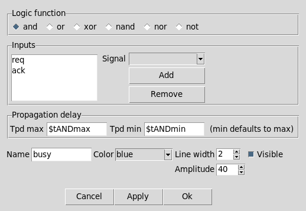
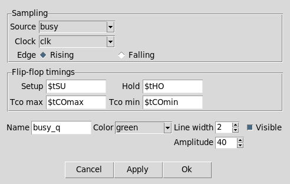

# How to create logic and sampled signals

A **derived signal** is not drawn from a list of edges like an input or an output: its waveform is *computed* from other signals of the diagram. Two commands create them:

- `create_logic` combines any number of signals with `and`, `or`, `xor`, `nand`, `nor`, or inverts one with `not`.
- `create_sampled` resamples a signal on a clock edge, the way a flip-flop does.

Derived signals are recomputed on every redraw. Editing an operand, changing a timing variable or moving an edge updates every signal that depends on it, with no extra command to run.

They also compose: the result of a derived signal is expressed exactly like any other waveform, so it can be measured by a timing marker, be annotated, or feed another derived signal.

## The value domain

Every waveform is reduced to four values before being combined or sampled:

| Waveform | Value |
|---|---|
| Low | `0` |
| High | `1` |
| Unknown | `x` |
| Bus data | `D` |
| Hi-Z | `1` when the signal was created `-pulled_up`, `x` otherwise |
| **A transition window** | `x` |

The last row is the important one. The gap between two states in an input or output signal is the min/max uncertainty window computed from its delays: the signal is *in transition* there, and its value is genuinely not known. Derived signals treat it as unknown, which is what makes the computed waveform show the real uncertainty instead of an idealized one.

A hi-Z interval resolves to `1` with a pull-up because a released open-drain net is pulled to logic 1; without one it floats and is unknown.

## Combining signals

```tcl
create_logic -name busy -op and -inputs {req ack} -visible
```

`-inputs` is a Tcl list of the operand names. `-op` accepts `and`, `or`, `xor`, `nand` and `nor` (two or more inputs) and `not` (exactly one input). The default is `and`.

The operands do **not** need to share a clock. The waveforms are combined in the time domain: every transition of every operand appears in the result, so signals launched by unrelated clocks combine correctly.

### The operator tables

Unknown propagates, except where a controlling value masks it:

| `and` | `0` | `1` | `x` |
|---|---|---|---|
| **`0`** | `0` | `0` | `0` |
| **`1`** | `0` | `1` | `x` |
| **`x`** | `0` | `x` | `x` |

| `or` | `0` | `1` | `x` |
|---|---|---|---|
| **`0`** | `0` | `1` | `x` |
| **`1`** | `1` | `1` | `1` |
| **`x`** | `x` | `1` | `x` |

| `xor` | `0` | `1` | `x` |
|---|---|---|---|
| **`0`** | `0` | `1` | `x` |
| **`1`** | `1` | `0` | `x` |
| **`x`** | `x` | `x` | `x` |

`nand` and `nor` are the inverted `and` and `or` tables, so `0 nand x` is `1` and `1 nor x` is `0`. `not` maps `0` to `1`, `1` to `0` and leaves `x` unknown. With more than two inputs the operator is applied across all of them: a single `0` forces an `and` low, a single `1` forces an `or` high, and `xor` gives the parity.

So `0 AND x` is `0` and `1 OR x` is `1`: a controlling value on one input hides the other input's uncertainty, exactly as a real gate does. `xor` has no controlling value, so any unknown on either input makes the result unknown.

### Gate delay

`-tpd_max {expr}` and `-tpd_min {expr}` delay the whole result by the gate propagation delay:

```tcl
create_logic -name busy -op and -inputs {req ack} \
   -tpd_max {$tANDmax} -tpd_min {$tANDmin} -visible
```

Both are Tcl expressions, like every timing quantity of TimeIt. `-tpd_max` defaults to 0 and `-tpd_min` defaults to the value of `-tpd_max`, so a single value shifts the waveform without changing it. When the two differ, the spread between them widens every transition window of the result, exactly like the min/max delays of an input or output signal: the output is only established once the slow path has propagated, and may start changing as soon as the fast path does. A pulse narrower than the spread becomes entirely uncertain.

### What cannot be an operand

- **A clock.** Use the clock's waveform through an input or output signal instead.
- **A signal carrying bus data** (`-data_edges`). A bus window has no scalar value to combine.
- **An analog (PWL) signal.**
- **The signal itself, or anything that already reads it.** A definition that would close a dependency loop is refused, naming the input through which the loop would close.

## Resampling on a clock edge

```tcl
create_sampled -name busy_q -source busy -clock clk -edge rising -visible
```

`-source` is the signal to sample, `-clock` the sampling clock and `-edge` is `rising` (the default) or `falling`. The output holds each captured value until the next sampling edge.

Unlike a logic operand, the source **may** be a bus: the captured data window is held to the next edge like any other value. The source may also be another derived signal, so combining and resampling chain freely.

Before the first sampling edge the output is unknown: a flip-flop has no defined value until it is first clocked.

Two consecutive edges capturing the same value produce no transition: a flip-flop whose output does not change does not glitch.

### The sampling aperture

At every sampling edge the source is examined over the aperture

```
[ t - setup , t + hold )
```

If one stable value covers the whole aperture, that value is captured. Anything else, a transition window overlapping the aperture, an unknown region, or two different values, captures as **unknown**, and the output stays unknown until the next sampling edge at least. That is how a setup or hold violation shows up on the diagram.

The aperture is **half-open**, so the marginal cases *meet* their requirement, as timing convention expects: a transition ending exactly at `t - setup` has settled in time, and one starting exactly at `t + hold` has held long enough.

```tcl
create_sampled -name late_q -source late -clock clk \
   -setup {$tSU} -hold {$tHO} -visible
```

`-setup` and `-hold` both default to 0. With both omitted the aperture collapses to the sampling instant itself, and the flip-flop simply reads the value at the clock edge.

### Clock-to-output delay

`-tco_max {expr}` and `-tco_min {expr}` give the longest and shortest delay from the sampling edge to the output change. The spread between them is drawn as the transition window on each output edge. Both default to 0, in which case the output changes exactly at the clock edge.

### Gated sampling clocks

Sampling on a gated clock works as expected: a suppressed pulse provides no sampling edge, so the output simply holds through the gap.

### Sampling across clock domains

Any clock may be used as the sampling clock, including one unrelated to the clock that launched the source.

Be careful reading the result. In TimeIt every clock is drawn on a single timebase starting at t = 0, so the picture is deterministic *as drawn*. For genuinely asynchronous domains this shows one arbitrary phase alignment out of many, and it must **not** be read as a clock-domain-crossing correctness argument. It is a drawing of one case, not a proof.

## Creating them from the GUI

Right-click on the canvas and pick **New Signal → Logic…** or **New Signal → Sampled…**. If you right-clicked on a signal, it is offered as the first input (logic) or as the source (sampled); right-clicking on a clock offers it as the sampling clock.



In the logic dialog, pick the operator, then build the input list: choose a signal in the **Signal** box and press **Add** (double-click an entry, or select it and press **Remove**, to drop it). The box only lists the signals `create_logic` would accept, so clocks, buses, PWL signals, the signal itself and anything that would close a dependency loop are never offered. Choosing `not` keeps a single input. The propagation delays are typed as Tcl expressions, exactly as on the command line.



The sampled dialog takes the source, the sampling clock and edge, and the four flip-flop timings.

Right-click a derived signal and pick **Edit Signal** to reopen its dialog and change the operator, the inputs, the source or the timings. Changing the **Name** creates a copy under the new name, as with every other signal dialog (see [How to copy a signal](10_copy_signal.md)).

As with every other dialog, the change is applied by running the equivalent Tcl command, so it appears in the session log, is saved with the diagram, and can be undone with Ctrl-Z.

## Visibility

`-visible` draws the signal; without it the signal is computed but not shown. A hidden derived signal is still recomputed and can still be read by others, which is the way to build an intermediate term without cluttering the diagram:

```tcl
# Not drawn, but usable as an operand.
create_logic -name sel -op xor -inputs {a b}

create_logic -name out -op and -inputs {sel en} -visible
```

## Removing a derived signal or its operands

A derived signal holds a direct reference to its operands (for a sampled signal, its source and its sampling clock), so removing a signal that one of them reads is **refused**, with a message naming the dependents. Remove the derived signals first, or edit them to read something else.

## Limitations

- Derived signals are **not** written to SDC by `write_sdc`. They model internal nodes, not I/O pins, and are silently omitted.
- A derived signal can not be the enable signal (`-enabled_by`) of a gated clock. Only inputs and outputs may gate a clock.
- A signal whose operands or delays cannot be resolved cannot be drawn, and TimeIt **removes any signal it cannot draw**. It is not merely hidden. Check the console for the reason.

Run `create_logic -help` or `create_sampled -help` for the full syntax.

---

*Previous: [How to create PWL (analog) signals](20_pwl_signals.md) | Back to [Introduction](00_introduction.md)*
